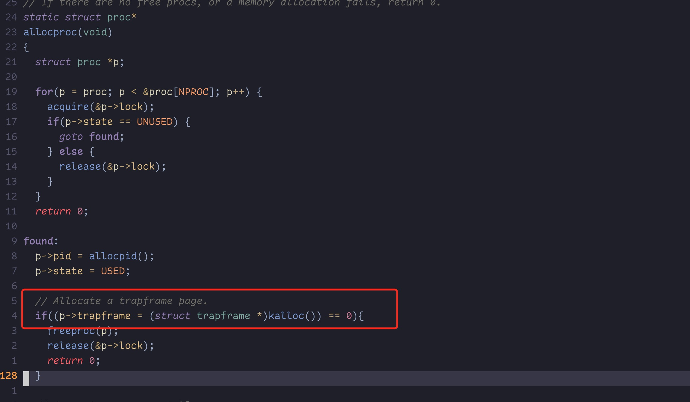

在xv6里面有三种类型的事件将会导致CPU暂时暂停普通指令的执行,而将控制权转移到一段特殊代码上用来处理这些事件.其中一类就是`system call`,当用户程序尝试执行`ecall`指令来要求kernel做一些事情.另外一种类型就是`exception`,异常是用户指令或者kernel指令做了一些非法的事情,例如做一个除法计算,除数是0,或者使用了一个非法的内存地址.第三种就是设备中断,当一个设备发送一个信号来表明它希望被关注到,例如磁盘完成了一次读写请求.

&emsp;在这本书里面我们采用`trap`来统称这些类型事件.特别是在`trap`发生那一刻,无论当时运行什么代码指令,他们都会在稍后被恢复继续执行.我们总是希望`trap`是透明的,这个对设备中断是非常重要的,但是有些中断是我们不希望有的.`trap`通常执行顺序是:trap强制将控制权转移到kernel;然后此时kernel会将当前进程的寄存器和其他的一些信息给保存起来,以便它恢复后继续运行,然后kernel开始执行对应的handler代码(这个代码可能是一个syscall实现,也有可能是设备驱动来实现的);handler 执行完成恢复原始用户代码继续执行.

&emsp;xv6所有的trap都是在kernel里面执行的.trap不会转移到用户代码.针对system call类型的trap,在kernel里面执行这个是很自然的事情. 针对中断类型的trap这个似乎也是合理的,因为隔离的要求,硬件设备只有kernel可以访问,然后kernel在为各个进程之间共享设备提供了一种便利的机制.针对异常类型的trap这个似乎也是同样合理的,因为xv6响应所有来自用户态的异常是通过kill不合法的program.

&emsp;xv6的trap处理主要有四个步骤:RISC-V CPU将会执行一些硬件操作(就是一些汇编指令用来执行kernel C代码),c代码用来决定针对这个trap应该做哪些操作,例如如何执行system call,或者应该路由到哪个设备驱动服务.由于这三种trap类型的共性,这个希望kernel能用一个代码路径来处理所有的trap, 这个似乎要比把代码拆分成三个独立的case要方便的多得多:来自用户态的trap,来自kernel的trap,和时间中断.kerner用来处理中断的代码(C代码或者汇编代码)有时候又称为handler.第一个handler通常是汇编实现的(而不是C代码),这个有时候又被称为`vector`.


## RISC-V Trap machinery
&emsp;每一个RISC-V CPU都有一组控制寄存器,kernel可以通过读写这些寄存器来告诉CPU他们应该如何处理这些trap,并且kernel也可以通过这个来发现当前哪一个trap被触发了.RISC-V 文档里面包含了整个逻辑.`riscv.h`里面包含了xv6使用到的相关的定义.下面我们列举一些非常重要的寄存器:
- `stvec`: kernel将一个trap handler的地址写入到这个里面. RISC-V会跳转到这个寄存器里面保存的地址的地方来执行handler.
- `sepc`: 当一个trap发生的时候.RISC-V用来保存程序计数器的地方.(因为PC寄存器的值在待会儿就会被stvec的值给覆盖掉,因此需要提前把PC寄存器的值给保存到sepc寄存器里面).`sret`指令(在trap结束的时候)它会把`sepc`寄存器里面值重新给copy到pc寄存器里面(用户态程序可以继续往下执行),从另外一个方面看kernel也可以通过修改`sepc`寄存器的值来控制`sret`走向.
- `scause`: RISC-V会在里面放置一个数值编号(这个数值编号用来描述trap发生的原因)
- `sscratch`: `sscratch`寄存器里面保存`process->trapfram` 地址,在进入trap的时候会把当前process寄存器/stack/等信息都保存到到`process->trapfram`里面
- `sstatus`: `sstatus`寄存器用来控制`SIE`位,用来是否开启设备中断.如果kernel清理了SIE位,RISC-V将会一直延迟驱动中断的执行,直到kernel 重新设置SIE位.SPP寄存器用来表明这个trap是来自用户态还是supervisor模式下,用来控制sret指令返回的mode.

&emsp;上面一些和trap handler相关的寄存器只能在supervisor模式下操作,他们无法在user mode下面进行读写.其实同样还有一组控制器寄存器只能在machine mode下操作;xv6用他们来处理一些特殊的中断例如时钟中断.

&emsp;在多核的芯片上,每个CPU都有一组上面这些寄存器,在同一时间也许有不止一个CPU在处理同一个trap.

&emsp;硬件处理的部分:当需要强制执行一个trap的时候,RISC-V硬件针对所有的trap的处理逻辑如下(当然不包括timer 中断):
1. 如果这个trap是一个设备中断的时候,那么`sstatus`寄存器里面SIE位会被清理掉(下面的不会在执行)
2. 通过清理掉`sstatus`寄存器里面的SIE的位来禁用中断.
3. 将`pc`寄存器的值copy到`sepc`寄存器里面(这个是用来保存当前函数程序计数器以便trap完成后恢复用户程序继续运行)
4. 将当前模式通过在`sstatus`里面设置SPP值来保存下来.
5. 通过`scause`寄存器来保存当前trap的原因.
6. 将模式设置为supervisor mode.
7. 将stvec寄存器保存到pc寄存器里面.
8. 然后在PC寄存器里面保存的新的地方开始执行(也就是执行handler)
> 硬件执行流总结: 
> 1. 如果是设备中断: 通过clean sstatus寄存器里面的SIE位来禁用中断(硬件工作只有这么多)
> 2. 如果是syscalll/timer 禁用中断--> 保存pc(将pc寄存器值复制给sepc) -> 保存当前mode -> 设置mode -> 将stvec 值保存到pc寄存器里面

&emsp;我们需要注意的是kernel并不会把也表切换到kernel的页表,也不会把stack切换到kernelstack,也不会保存除了PC寄存器意外的任何寄存器的值.kernel必须执行这些任务.其中一个原因就是CPU会尽可能的最最小工作在trap的时候,以便给软件提供更高的灵活性.例如:一些操作系统会省略页表的切换操作来提升trap的性能.

&emsp;上面8个步骤是不是有哪些可以省略的?这是值得我们思考的一件事情,也许可以找到一个途径使得trap更快. 虽然简单的工序也能正常的工作,但是通常情况下如果省略了这些步骤是比较危险的.这个可能会导致当一个trap从user mode切换到supervisor mode的时候,这时候也许还在执行用户指令,这些用户指令也许会破坏kernel和用户的隔离性.例如通过修改`satp`寄存器来指向一个可以访问整个物理内存的pagetable. 因此对于CPU来说切换到一个特殊的kernel指令的地址是非常重要的(stvec).

## Trap from user space
&emsp;xv6针对来自不同trap的处理逻辑是不一样的.这个章节我们展示针对来自用户代码部分trap的处理部分.然后来自kernel代码相关的trap我们将会在section4.5部分介绍.
&emsp;当一个用户程序执行了一个system call（ecall 指令)的时候也许会触发trap,或者做了一些非法的事情,或者是一个设备中断.一个来自用户代码的trap的大概路径如下:首选它来自用户空间的`uservec`(kernel/trampoline.S:16)然后使用`usertrap`(kernel/trap.c:37),然后在returning,`usertrapret`(kernel/trap.c:90)在然后`userret`(kernel/trampoline.S:88)

userrest指令开始执行一些寄存器恢复的操作
```asm
userret:
        # userret(TRAPFRAME, pagetable)
        # switch from kernel to user.
        # usertrapret() calls here.
        # a0: TRAPFRAME, in user page table.
        # a1: user page table, for satp.

        # switch to the user page table.
        csrw satp, a1
        sfence.vma zero, zero

        # put the saved user a0 in sscratch, so we
        # can swap it with our a0 (TRAPFRAME) in the last step.
        ld t0, 112(a0)
        csrw sscratch, t0

        # restore all but a0 from TRAPFRAME

	# restore user a0, and save TRAPFRAME in sscratch
        csrrw a0, sscratch, a0
        # return to user mode and user pc.
        # usertrapret() set up sstatus and sepc.
        sret
```

&emsp;xv6在处理trap的时候一个主要的限制就是当发生trap的时候它不会去切换页表.这就意味着`stvec`里面是的地址必须是用户pagetable里面一个合法的映射,因为当trap开始执行时候这个页表是有效的.更远一点,xv6在执行handler函数的时候需要切换到kernel pagetable,为了在mode切换后能够正常的执行,kernel pagetable里面也必须要有一个mapping是指向`stvec`存储的handler的地址.

&emsp;xv6通过一个`trampoline`的page来完成这些需求.这个trampoline里面包含`uservec`,xv6 trap处理`stvec`指向的代码.这个trampoline在每个process里面都有,它位于process pagetable的虚拟地址是`TRAMPOLINE`的地方.`TRAMPOLINE` 这是位于虚拟地址的尾部(也就虚拟地址最高位),因此它在程序执行自身代码所在内存的上面.这个trampoline同样也会在kernel pagetable里面映射一个`TRAMPOLINE`. 由于`trampoline`page被映射在user page table里面,所以它的flag被设置了`PTE_U`,因此trap在supervisor模式下是可以在这个地方执行的.又因为`trampoline`也同样被映射在kernelpage相同的位置,因此在page table被切换到kernel的page table的时候trap handler仍然可以执行.


```c
// 每个process用来执行handler的代码都保存在trampoline.S里面
// per-process data for the trap handling code in trampoline.S. 
// trapframe在各自的一个page里面,这page 位于trampoline页面的下面,没有映射在kernel page table里面
// sits in a page by itself just under the trampoline page in the user page table. not specially mapped in the kernel page table.
// sscratch寄存器里面地址就指向这个地方
// the sscratch register points here.
// uservec里面代码会把用户寄存器的值都保存在这个结构体里面
// uservec in trampoline.S saves user registers in the trapframe,
// 然后会用trapframe's里面的kernep_sp, kernel_hartid, kernel_satp 里面的值来初始化寄存器,然后跳转到`kernel_trap`地方开始执行
// then initializes registers from the trapframe's  kernel_sp, kernel_hartid, kernel_satp, and jumps to kernel_trap.
// usertrapret() 和 useret() 函数用来设置 trapfram's kernel_*, 然后从trapframe里面恢复用户寄存器的值,然后切换到用户的pagetable.最终进入到usermode.
// usertrapret() and userret in trampoline.S set up  the trapframe's kernel_*, restore user registers from the  trapframe, switch to the user page table, and enter user space.
// trapframe 包含了调用者保存用户寄存器类似s0-s11这些, 因为返回到用户路径的代码`usertrapret`并不会返回整个调用连.
// the trapframe includes callee-saved user registers like s0-s11 because the  return-to-user path via usertrapret() doesn't return through  the entire kernel call stack.
struct trapframe {
  /*   0 */ uint64 kernel_satp;   // kernel page table
  /*   8 */ uint64 kernel_sp;     // top of process's kernel stack
  /*  16 */ uint64 kernel_trap;   // usertrap()
  /*  24 */ uint64 epc;           // saved user program counter
  /*  32 */ uint64 kernel_hartid; // saved kernel tp
  ...
};
```
```asm
.globl uservec
uservec:    
	#
        # trap.c sets stvec to point here, so
        # traps from user space start here,
        # in supervisor mode, but with a
        # user page table.
        #
        # sscratch 寄存器里面的存放了process's p->trapframe, 这段内存存放在TRAPFRAME虚拟地址这
        # sscratch points to where the process's p->trapframe is  mapped into user space, at TRAPFRAME.
        #
        
	# swap a0 and sscratch
        # so that a0 is TRAPFRAME  交换a0和 sscratch寄存器里面的内容
        csrrw a0, sscratch, a0
        sd ra, 40(a0)       # 下面操作a0其实就是操作trapfram这个结构体里面的字段
        # 将当前寄存器的值保存到trapframe里面
        ...

        # save the user registers in TRAPFRAME 
	# save the user a0 in p->trapframe->a0 (此时a0是p->trapframe的值,而原始的a0被放到sscratch寄存器里面了)
        csrr t0, sscratch       // 将sscratch寄存器里面的值(也就是原始的a0寄存器里面值)存放到t0寄存器
        sd t0, 112(a0)          // 将t0寄存器的值存放到p->trapframe->a0里面

        # 将用户程序的kernelstack保存到p->trapframe->kernel_sp里面
        # restore kernel stack pointer from p->trapframe->kernel_sp
        ld sp, 8(a0)

        # make tp hold the current hartid, from p->trapframe->kernel_hartid
        # tp寄存器里面存放当前CPU的 hartid, 将当前hartid 保存到p->trapframe->kernel_hartid
        ld tp, 32(a0)

        # 将userstrap的地址保存到 p->trapframe->kernel_trap里面
        # load the address of usertrap(), p->trapframe->kernel_trap
        ld t0, 16(a0)

        # restore kernel page table from p->trapframe->kernel_satp
        # 在此之前一直使用的是process pagetable
        # 将kernel pagetable 写入到satp里面.然后重新全部刷新TLB
        ld t1, 0(a0)
        csrw satp, t1
        sfence.vma zero, zero

        # a0 is no longer valid, since the kernel page  table does not specially map p->tf.
        # 这个时候a0就没有啥意义了,因为此时已经切换到kernel的pagetable,而pagetable不存在到trapframe的映射

        # jump to usertrap(), which does not return
        # 开始跳到usertrap里面执行
        jr t0

```


&emsp;用来处理trap的代码`uservec`在`trampoline.S`里面(kernel/trampoline.S:16).当`uservec`启动的时候,这个时候32个寄存器里面存储的时候当前触发trap的用户代码的上下文.(在启动完就需要从usermode switch 到 supervisor mode,因此这些上下文需要被保存,而且supervisor mode也是有限的,因为隔离不能确保用户代码是没问题的,因此这些寄存器不应该被访问, 只是单纯的copy).这32个寄存器需要被保存在内存某一地方,以便当从trap返回的时候,他们可以被恢复过来.保存数据就需要使用寄存器里面保存的地址,但是目前没有通用寄存器来可以供我们使用了.幸运的时候RISC-V给我们提供了帮助, 它给我们提供了`sscratch`寄存器.在`uservec`开始的指令`csrrw`将`a0`寄存器里面的值和`sscratch`寄存器里面的值做了交换.现在用户代码寄存器`a0`被保存在`sscratch`寄存器里面.现在`uservec`有了一个通用寄存器`a0`可以让我们来使用了(此时a0里面保存的是先前sscratch寄存器里面内容,也就是p->trapfram结构体的地址)

&emsp;`uservec`下面的工作就是保存这32个寄存器.在进入用户态之前,kernel就已经将`sscratch`里面值设置为指向了process的`trapfram`结构体,这个结构体有足够的空间来存储32个寄存器.因为在这个时候`satp`寄存器里面的值指向的仍然是用户态的pagetable.`uservec`需要使用到`trapfram`这个结构体,因此`uservec`需要`trapfram`被映射到用户态的地址空间.当创建一个进程的时候,xv6就会每个进程的trapframe分配一个单独的页面,这个页面被映射到`TRAPFRAME`这个虚拟地址那(这个地址在TRAMPOLINE地址下面).当我们使用内核页表时，TRAPFRAME已经不是正确的trapframe的虚拟地址了,在p->trapframe有正确的虚拟地址,这个地址也是物理地址(p->trapfram指向的是物理地址,而不是虚拟地址,因此kernel可以直接使用这个地址)




&emsp;由于`a0`寄存器和`sscratch`寄存器里面值互换了,因此我们可以通过`a0`寄存器来将用户态的所有的寄存器都保存下来,包括原始的`a0`寄存器的值(原始`a0`寄存器的值存储在`sscratch`寄存器里面)

&emsp;`trapfram`里面包含了当前进程的的kernel stack,当前CPU的hartid,`usertrap`函数地址,以及kernel的pagetable.`uservec`可以获取到这些地址,然后吧pagetable切换到kernel的pagetable,然后开始调用`usertrap`函数.

&emsp;`usertrap`的工作就是先判断下trap的原因,然后处理它,最后return.(kernel/trap.c:37).它首先会把`kernelvec`的地址设置到`stvc`寄存器里面,因为现在已经是kernel mode,在kernel里面执行`kernelvec`而不是`uservec`. 并且它保存`sepc`寄存器,是因为`usertrap`也许会调用`yeild`函数来进入另外一个kernel线程里面,并且在这个kernel线程里面也许会修改`sepc`寄存器(如果`secp`被修改了,并且之前值没有被保存下来,那么这个kernel线程返回用户态的时候可能会有跳转到一个意外的地址上执行).如果这个trap的类型是一个syscall,那么`usertrap`会调用`syscall`来处理它.如果是一个设备中断,那么会执行`devintr`,如果是一个异常,那么kernel就会kill掉这个出错的进程.在调用syscall这条路径上,我们将保存的用户pc寄存器的值加了4,因为在syscall这个分支里面,syscall指令占四位,因此在返回用户态的时候用户希望继续执行syscall之前的指令,而不是继续执行syscall,因此我们需要将epc里面值+4.在这个处理完了之后,`usertrap`也许检查用户进程是不是已经被kill掉了,或者是不是应该执行`yield`(timer trap).

```c
//
// handle an interrupt, exception, or system call from user space.
// called from trampoline.S
//
void usertrap(void) {
  int which_dev = 0;
  if((r_sstatus() & SSTATUS_SPP) != 0) panic("usertrap: not from user mode"); // 检查是不是来自用户态代码触发的trap
  // send interrupts and exceptions to kerneltrap(), // since we're now in the kernel.
  w_stvec((uint64)kernelvec);   // 将异常和中断发送给kerneltrap执行,因为触发异常的时候现在进入了kernel 模式
  struct proc *p = myproc();
  // save user program counter. 因为p->trapframe里面存储的是物理地址,因此在kernel pagetable里面仍然可以使用p->trapframe
  p->trapframe->epc = r_sepc(); // 保存当前正在运行的程序的程序计数器
  if(r_scause() == 8){ // system call // scause寄存器里面保存的时候触发trap的类型,如果是syscall类型则进入当前分支
    if(p->killed) exit(-1); 
    // sepc points to the ecall instruction, but we want to return to the next instruction.
    // 这个地方意味着用户态当时的代码执行了ecall,因此p->trapframe->epc里面保存的是ecall指令,额call指令占四个字节,我们希望在trap 执行完后继续执行ecall后面的指令,因此p->trapframe->epc 我们加了4
    p->trapframe->epc += 4;
    // an interrupt will change sstatus &c registers, so don't enable until done with those registers.
    intr_on(); //中断会修改sstatus 和  c registers寄存器，因此等这些寄存器全部完成才能打开中断(当进入trap的时候硬件会自动通过设置sstatus的SIE寄存器来禁用中断)
    syscall(); //执行syscall
  } else if((which_dev = devintr()) != 0){ // 设备驱动触发的trap类型
    // ok
  } else { // 未能识别的trap类型
    printf("usertrap(): unexpected scause %p pid=%d\n", r_scause(), p->pid);
    printf("            sepc=%p stval=%p\n", r_sepc(), r_stval()); p->killed = 1; }
  if(p->killed)
    exit(-1);
  // give up the CPU if this is a timer interrupt.
  if(which_dev == 2) // 处理时钟中断
    yield();
  usertrapret(); // 最后调用usertrapret 返回
}
```
&emsp;返回用户态的第一步是调用`usertrapret`函数(kernel/trap.c:90).在这个函数里面会对一些RISC-V控制寄存器做一些设置,以便将来可以再次处理来自用户态的trap.这个步骤包括:把`stvec`里面值设置为`uservec`,准备一些trapframe,因为`uservec`依赖这个玩意,因为`uservec`它也依赖这个玩意,并且将`sepc`设置为先前保存的程序计数器.并在最后`usertrapret`会调用`userret`,`useret`保存在trampoline 页面里面(trampoline无论是在kernel还是prog的page table里面都是映射到同一个页面),因为在`userret`里面会有页面切换操作.

```c
// return to user space
void usertrapret(void) {
  struct proc *p = myproc();
  // we're about to switch the destination of traps from
  // kerneltrap() to usertrap(), so turn off interrupts until
  // we're back in user space, where usertrap() is correct.
  intr_off(); // 因为我们需要恢复一些寄存器,因此需要关闭中断

  // send syscalls, interrupts, and exceptions to trampoline.S
  w_stvec(TRAMPOLINE + (uservec - trampoline));

  // set up trapframe values that uservec will need when
  // the process next re-enters the kernel.
  // 重新设置trapframe的值, 因为来自用户态的trap需要用到这些值
  // 将kernel的页表保存到kernel_satp里面
  p->trapframe->kernel_satp = r_satp();         // kernel page table
  // 保存process的kernel stack
  p->trapframe->kernel_sp = p->kstack + PGSIZE; // process's kernel stack
  // 保存 kernel_trap handler的地址,这里我们还原成usertrap
  p->trapframe->kernel_trap = (uint64)usertrap;
  p->trapframe->kernel_hartid = r_tp();         // hartid for cpuid()

  // set up the registers that trampoline.S's sret will use
  // to get to user space.
  
  // set S Previous Privilege mode to User.
  unsigned long x = r_sstatus();
  x &= ~SSTATUS_SPP; // clear SPP to 0 for user mode
  x |= SSTATUS_SPIE; // enable interrupts in user mode
  w_sstatus(x);

  // set S Exception Program Counter to the saved user pc.
  w_sepc(p->trapframe->epc);

  // tell trampoline.S the user page table to switch to.
  uint64 satp = MAKE_SATP(p->pagetable);

  // jump to trampoline.S at the top of memory, which 
  // switches to the user page table, restores user registers,
  // and switches to user mode with sret.
  uint64 fn = TRAMPOLINE + (userret - trampoline);
  ((void (*)(uint64,uint64))fn)(TRAPFRAME, satp);
}
```

&emsp;`usertrapret`调用`userret`,并且将参数传入`a0`寄存器里面,然后把process的pagetable传入到`a1`寄存器里面.(kernel/trampoline.S:88).`userret` 会把`satp`设置为process page table.我们重新回顾下,user pagetable 同时映射了trampoline 和 TRAMFRAME,但是他们并不是来自kernel. 事实是trampoline页面在userpagetable和kernel的pagetable 都被映射到同一个虚拟地址,以便uservec 在切换页表之后他能够继续运行(因为虚拟地址是一样的,也就物理地址不一样,在用户态执行用户态的handler,在内核态执行内核态的handler.). `userret`将保存在trapframe里面的`a0`寄存器的值copy到`sscratch`寄存器里面.然后将保存在trapframe里面的寄存器都恢复过来.  最终再将`a0`(此时a0是trapframe)和`sscratch`(此时sscratch寄存器里面的值保存的是原始的a0寄存器的值)最交换.(此时sscratch里面重新保存了用户程序的trapframe).然后调用`sret`返回用户态.

```asm
.globl userret
userret:
        # userret(TRAPFRAME, pagetable)
        # switch from kernel to user.
        # usertrapret() calls here.
        # a0: TRAPFRAME, in user page table.
        # a1: user page table, for satp.

        # switch to the user page table.
        # 切换页表 ,然后刷新TLB 缓存
        csrw satp, a1
        sfence.vma zero, zero

        # put the saved user a0 in sscratch, so we
        # can swap it with our a0 (TRAPFRAME) in the last step.
        ld t0, 112(a0)  // 将保存在trapframe寄存器里面的值a0保存到t0
        csrw sscratch, t0       //  然后原始的a0寄存器的值存放到sscratch寄存器里面

        # restore all but a0 from TRAPFRAME
        # 将保存trapframe里面所有寄存器的值都恢复过来
        ld ra, 40(a0)
        ....

	# restore user a0, and save TRAPFRAME in sscratch
        csrrw a0, sscratch, a0
        
        # return to user mode and user pc.
        # usertrapret() set up sstatus and sepc.
        sret
```

## Code: Calling system calls
&emsp;第二章里面我们以一个调用`exec`的系统调用例子结束(initcode.S)(user/initcode.S:11).现在让我们看下用户态的systemcall是如何到达kernel实现的systemcall的.
&emsp;`initcode.S`将`exec`的参数放在`a0`和`a1`寄存器里面,然后把systemcall的编号放到`a7`寄存器里面.`System call`的编号要和定义在`syscalls`数组里面定义好的匹配,一个存放了函数指针的table.当`ecall`陷入到kernel的时候,将会触发`uservec`,`usertrap`然后才是`systemcall`来执行,正如我们上面看到的.

&emsp;`syscall`(kernel/syscalls:133)从trapframe->a7寄存器里面获取到syscall的编号,然后用它在`syscalls`里面检索具体的syscall函数.针对第一个systemcall,`a7`寄存器里面包含的是`SYS_exec`(kernel/syscall:8),这个最终会导致system call去调用`sys_exec`这个函数.

&emsp;当syscall返回的时候,`syscall`会把它的返回值记录在`p->tramframe->a0`寄存器里面.这导致user-space 调用`exec()`来返回这个值,由于RISC-V的C 调用规范是把返回值存放在a0寄存器里面.system call调用约定就是成功返回0,失败返回负数.如果一个systemcall是非法的,那么`syscall`会打印错误并且返回-1.

## Code: System call arguments
&emsp;Kernel实现的System call需要能够找到UserCode传进来的参数.因为user code调用的systemcall 是封装好的system call函数,参数初始化根据RISC-V 调用约定他们被初始化在寄存器里面.kernel trap的代码将user code所有寄存器的值都保存在trapframe里面,这个地方kernel是可以找到的.kernel的`argint`和`argaddr`以及`argfd`这两个函数可以获取system call的第N个参数分别是把他们当作整数,指针,以及一个文件句柄.这三个函数本质上都是通过调用`argraw`来从保存用户寄存器里面获取合适的值.

&emsp;一些systemcall通过传递指针来当作参数,而kernel将会使用这些地址来读写用户内存数据.`exec`system call,传递给kernel的是一个指针数组,里面指针指向用户空间的字符串.这些指针带来了两个挑战:第一个挑战是:用户的程序也许是有bug或者是恶意的,所以传递给kernel的地址也许会破坏一些东西或者访问kernel内存,而不是用户内存 .第二个问题:kernel的page table映射和内核的映射不一样,因此kernel就不能直接单纯使用普通的加载指令来访问用户地址空间.

&emsp;kernel提供了一些比较安全的函数来通过用户提供的地址来传入和传出数据.`fetchstr`就是一个例子(kernel/syscall.c:25).文件系统调用例如`exec`使用`fetchstr`从用户地址空间来获取文件名称.`fetchstr`函数是通过`copyinstr`来完成这些困难的工作.

&emsp;`copyinstr`(kernel/vm.c:398)最多copymax个bytes从用户页表里面虚拟地址`srcva`到`dst`.由于`pagetable`并不是当前的pagetable,copyinstr将会使用walkaddr来从pagetable里面检索srcva,最终找到物理地址pa0.kernel 是将每个物理页面一一映射到对应的虚拟地址,因此copyinstr就可以直接从pa0里面copy string bytes到dst里面.walkaddr将会检查用户提供的虚拟地址是不是用户空间的一部分,因此Program是无法欺骗kernel来试图读取其他程序的内存的.类似的函数也有copyout,将kernel里面内存数据copy到用户空间.


## Trap from kernel space
&emsp;根据是来自kernel的trap还是来自用户空间的trap,xv6对CPU的trap略有点不同.当kernel代码正在CPU上运行,那么kernel会把`stvec`指向位于`kernelvec`的汇编代码.(kernel/kernelvec.S:10).由于xv6已经就在kernel里面了,`kernelvec`就可以直接用`satp`(这个已经就是kernel pagetable),以及当前的栈(也是一个合法的kernel栈).`kernelvec`将32个寄存器push到stack上,以便稍后可以无缝的直接从中断代码恢复的时候直接把他们还原.

&emsp;`kernelvec`将32个寄存器保存在中断代码的线程栈上,这个是很合理的,因为这些寄存器就是中断代码的一部分. 保存在栈上这个还是非常重要的,如果一个trap切换到另外一个kernel物理线程, 在这种情况下,从新线程返回是非常容易的(调用新线程),这个时候在栈上保存的中断线程的寄存器还是很安全的.


&emsp;`kernelvec` 在保存完寄存器后,它就会调用`kerneltrap`函数.`kerneltrap`只处理两种类型的trap:设备中断,以及exception.它会调用`devintr`(kernel/trap.c:177)来检查并且处理former.如果trap并不是设备中断,那么它就必须是一个异常,如果这个异常是发生在内核里面的,那么它通常是非常严重的错误, 这个时候kernel就会调用`panic` 函数,并且暂停执行.

&emsp;如果`kerneltrap`是因为timer中断被调用的,并且有一个kernel线程(非调度线程)正在运行,`kerneltrap`会调用`yield`让其他的线程有机会得以继续运行. 并且在未来某一时刻,这个线程也会yield,让我们线程和它的`kerneltrap`恢复继续运行.(在7章我们会介绍yield)

&emsp; 当`kerneltrap`的工作完成,它需要恢复触发trap先前那个代码地方(触发trap的代码处).由于yield可能会污染`sepc`和先前的`sstatus`寄存器,因此`kerneltrap`在启动的时候会把他们保存起来. 现在可以恢复这些寄存器并且返回`kernelvec`代码处.`kernelvec`通过出栈方式恢复之前保存在栈中的寄存器和之前执行的`sret`,然后将`sepc`copy到`pc`寄存器里面,然后从kernel中断代码处恢复;


&emsp;值得思考的一件事情:当`kerneltrap`因为timer调用了`yield`,trap应该如何恢复.

&emsp;当cpu从用户空间进入kernel空间的时候,xv6会将`stvec`设置为`kernelvec`,这个我们可以在`usertrap`里面看到这个. 在这个地方存在一个空窗期,当kernel开始执行的时候,但是这个时候`stvec`里面保存的还是`uservec`地址,在这个空窗期需要确保没有设备中断发生.幸运的时候RISC-V在它开始准备执行trap的时候,它会禁用所有中断,直到它设置完`stvec`.


## Page-Fault Exceptions
&emsp;xv6针对异常的处理是非常粗暴的:如果这个异常发生在用户空间,kernel会直接kill这个异常的程序.如果异常发生在kernel,那么kernel panic.但是大部分真实的操作系统针对这些很有多不同的处理逻辑;

&emsp;例如有很多操作系统利用page faults来实现`copy-on-write`(COW)fork. 为了解释copy-on-write fork在之前文章里面介绍.在fork阶段,child的初始化内存的 内容和parent的内存内容是保持一致的.xv6是用`uvmcopy`来实现fork的,过程是给child分配物理内存,然后把parent内存里面的内容给copy到child内存里面. 当然如果child能够和parent 共享parent内存,那么这个过程会变得更加高效了.但是单纯的这样直接实现是不work的,这会导致child进程和parent进程互相干扰各种的执行,因为他们共享同一个heap和stack.

&emsp;但是parent进程和child进程可以通过合适的page 权限以及page fault来共享物理内存. 如果一个虚拟地址被使用了,但是它在pagetable里面没有映射,或者存在一个映射,但是它的`PTE_V`标记被清理掉了,或者因为一些权限位设置导致操作被拒绝,在这几个情况下CPU就会触发一个`page fault exception`.RISC-V针对这三种page fault做了区分: `load page fault`(当一个load指令无法转换它的虚拟地址时候就报这种异常),`store page fault`(当一个store指令无法转换虚拟地址时候抛这个异常),`instruction page fault`(当PC寄存器里面的地址无法被转换).`scause`寄存器里面保存了page fault 的类型,并且`stval`寄存器里面保存了无法被转换的地址.


&emsp;`COW`技术的初衷是为了解决在fork的时候,可以让child和parent之间共享所有的物理内存.但是在child进程里面针对这些物理内存的每个map都是只读的(把PTE_W标识给清理掉了).parent和child进程可以读取相同的物理内存里面的数据.如果任何一个page被写数据了,那么RISC-V就会触发了Page-Fault的exception.针对Page-Fault trap的处理逻辑如下:它会申请一个新的物理page,然后把虚拟地址指向错误(非法)的物理地址的内容给copy到新的页面里面(这个地方不需要考虑会不会读取到其他进程的物理page里面内容,因为page table是有kernel来管理的).然后kernel将出错进程里面相对应的PTE重新指向刚刚新创建的页面,并且允许这个进程对这个内存读写操作.然后返回到诱发这个pagetable进程的代码处进行执行,由于现在PTE是可以读写了,那么重新执行指令就不会出错了.copy-on-write 需要一个东西来帮值我们追踪什么时候可以释放一个物理page因为每个页面的都有可能被多个pagetable引用,当然这个依赖它的fork历史次数,page faults....这个用来追踪的玩意可以让做一些重要的优化:如果一个进程触发了一个存储页面的page fault, 如果这个物理页面只在当前进程的pagetabley引用,那么就不需要执行copy操作了.

&emsp;copy-on-write可以让`fork`更快,因为`fork`它压根不需要copy内存.一些内存只有在写的时候才会被copy,大部分例子里面很多内存基本上不需要copy.fork后面的另外一个例子是exec:由于fork只会在稍微要写的时候才会复制内存, 但是exec却是需要释放全部从parent继承而来的内存. copy-on-write技术遏制了一些不必要的内存copy.另外copy-on-write这个技术是透明的,用户程序不需要针对这个做任何适配.

&emsp;pagetable和Page-Fault这种组合给了我们很多很有趣的可能性,而不仅仅是cow技术.另外一个很有意思的用法是`lazy allocation`,这个有两部分. 第一;当一个应用程序通过`sbrk`来申请内存的时候,kernel就会知道需要增加多少内存,但是它不会分配物理内存,也不会为新申请内存的虚拟地址创建PTE. 第二:当这些新的虚拟内存有pagefable的时候,然后kernel才会分配一个物理内存然后把它映射到用户的pagetable里面.像cow fork一样,kernel也可以为应用程序实现透明的lazy allocation(而不需要用户程序做任何适配);

&emsp;由于应用程序经常会申请要比自己需要大得多的内存,lazy allocation有个非常不错的优势就是:kernel不需要为应用程序暂时不需要的页面做任何事情.另外一方面,当应用程序需要增加内存空间的时候,如果没有lazy allocation的sbrk 这个代价是非常昂贵的,如果app申请了GB大小的内存,那么kernel就不得不分配并且0初始化`262,144 4096-byte`page.lazy allocation就可以让这个过程随着时间的推移慢慢分散开来. 但是lazy allocation也会有些额外的问题(因为它在触发Page-Fault的时候才会去分配内存),当然这个过程也是需要kernel/user地址转换(这个相对一次性分配是一种额外的开销).当然操作系统在遇到page fault的时候分配一片连续的page,而不是一个page(这样来降低这些额外的开销.)

&emsp;还有一种流行的用法就是`demand paging`. 在exec里面, xv6是把应用程序整个文本和数据都加载到内存里面.由于应用程序可能非常的大,而且从磁盘上读取数据的代价是非常昂贵的,这个启动过程可能会导致用户非常烦躁:当用户从shell启动一个非常大的程序的时候,用户可能需要等待很久才能看到响应. 为了提升响应时间,现代化的操作系统为用户地址空间创建了pagetable,但是标识这些page是非法的.一旦触发一个pagefalut的时候,kernel会从磁盘上读取数据然后把他们映射到用户虚拟地址空间.和cow技术一样,kernel这些机制对用户来说也是透明的.

&emsp;在操作系统上运行的程序所需要内存可能超过物理内存所能容纳的.为了优雅的处理这个问题,操作系统实现了一种对磁盘分页的机制. 这个主要的思想就是只把一小部分的用户页面存放在内存里面,剩下的放在磁盘上一个分页区域.kernel将存放在分页区域的页面对应的虚拟内存标识设置为非法的. 如果一个应用程序尝试使用位于磁盘上分页区域的page的时候,这个时候就会触发一个page fault,这个page必须要被page in: 然后kernel trap handler就会分配一个物理页面,然后从磁盘上读取这个页面加载到内存里面,然后将对应PTE的地址修改指向这个内存. 

&emsp;如果一个page需要被page in,但是没有足够的内存,这个时候会发生什么呢? 在这种情况下,kernel必须首先释放一个物理页面,通过page out或者evicting方式把这个页面的内容 放置磁盘上page 区域;然后把指向这个内存的对应pagetable里面PTE设置为非法.Evicting是非常昂贵的操作,因此如果分页操作不怎么频繁的情况下性能是非常好的,最好的情况下应用程序最好使用他们已经存储在内存里面页面的一部分子集(这种情况下基本上不太会触发pagein操作),这种程序也会被称为具有良好的空间局部性.和之前我们介绍的几个虚拟内存技术一样,kernel实现对磁盘划分分页区域对应用程序来讲是透明的.

&emsp;计算机通常在很少或者几乎没有free内存的情况下就会触发pagein/out操作,而不是根据硬件提供了多少内存来决定触发的时机.例如云厂商可能在单个物理机器上来提供多个客户机以便高效的利用他们的硬件.另外一个例子就是在一个内存很小的智能手机上可以运行很多的apps.在这种设置里面分配内存首先需要删除一个现有的页面.因此当空闲内存非常稀缺的时候,分配内存的代价是非常昂贵的.

&emsp;当空闲内存非常稀缺的时候,这种延迟分配技术和`demand paging`技术显示非常重要.在`exec`和`sbrk` 这种急缺内存需求里面通过`evicting`内存来保证有足够的内存,这种操作代价是比较昂贵的.另外这种急切的内存分配可能会导致做许多无用功,因为内存本身就不是很充足,在应用程序使用这个页面之前,这个可能很有可能因为内存不足需要置换被kernel给置换到磁盘上(最极限的糟糕情况下就是死循环分配,一边分配一边回收,这边刚分配完,kernel就立马回收掉了它).

&emsp;这种组合衍生出来的其他高级用法还有自动栈扩容机制,以及mmap技术.

## 现实情况

&emsp;在现实的操作系统里面,也基本上实现了copy-on-write fork,layz allocation, demand paging, paging to disk,memory-mapped file,等.甚至在一些实际操作系统里面还会尝试使用整个物理内存, 不仅仅是提供应用程序,还用来做一些缓存.另外如果xv6 跑出了内存边界,它会报告一个错误给应用程序或者直接kill掉它,而不是evicting另外一个程序的page. 


