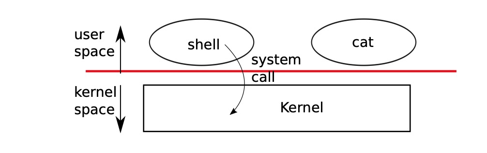
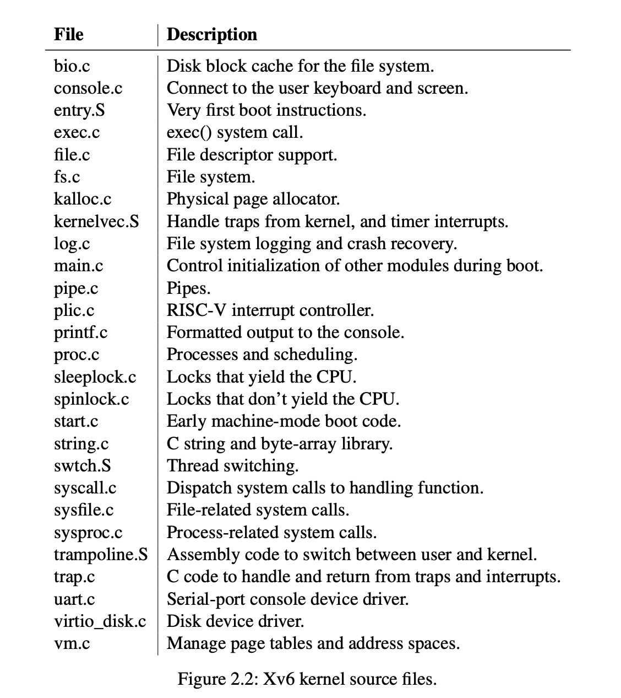
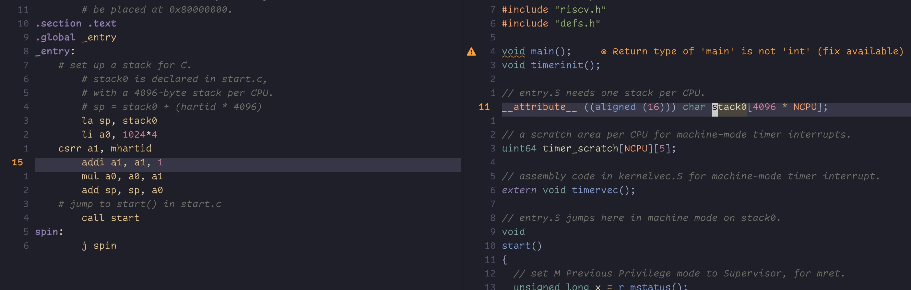
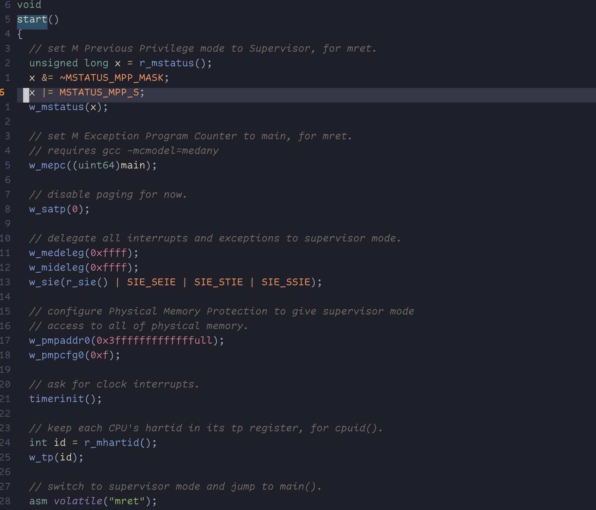
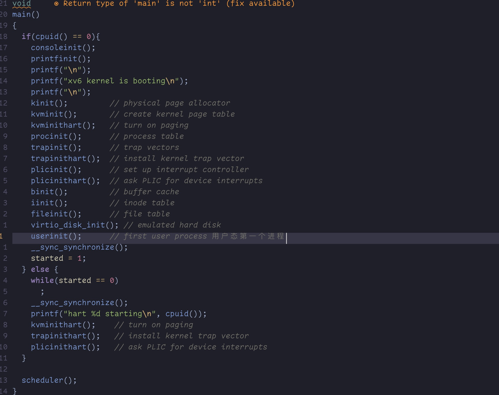
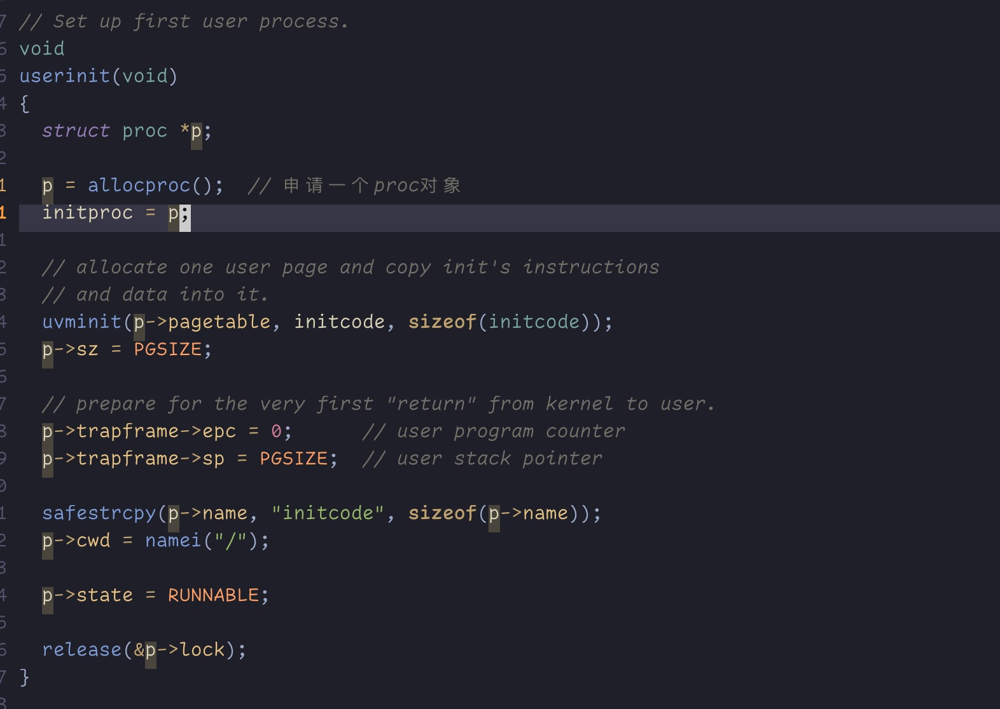
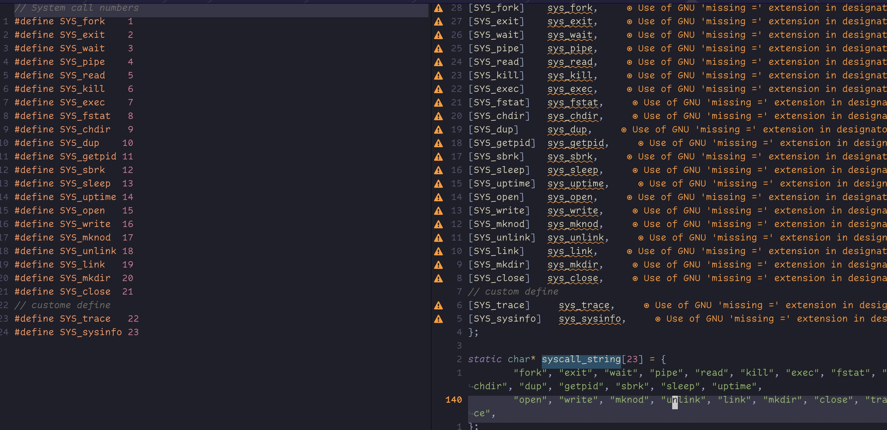

**操作系统组织结构**

&emsp;OS的设计需求就是可以一次可以服务多个Activties.例如我们可以使用`fork`系统调用来创建一个新的process.OS必须可以在多个process之间通过time-share的方式共享计算资源.例如如果process的数量要比CPU的数量还要多,那么os需要确保每个process都有机会可以得到运行.当然OS还需要确保每个进程之间的隔离性.这就意味着如果有一个process有一个bug或者病毒,那么它不应该影响到其他任何不依赖它的进程.完全意义上的隔离似乎又太严格了,由于某些情况下进程之间内部也需要进行互相通信(这个在我们lab1l里面pipe里面就体现出来了.). 因此OS需要完全满足下面三个需求:Multiplex,Isolation,Interaction.
&emsp;这部分章节我们将会展示OS是如何被组织来达到满足这些需求的. 这似乎很有很多方式可以满足这个,但是我们这里将围绕一种微内核体系来讨论,大部分的Unix系统都采用了这种体系结构.这章节同样我们也会提供Xv6process的概况(process),process是XV6最小的隔离单元,也会介绍XV6启动的第一个process.

&emsp;Xv6运行在多core的`RISC-V`微处理器上,它有很多底层的设计(例如process的实现)都是针对`RISC-V`来实现的.`RISC-V`是一个64位的处理器,并且xv6是用`LP64`的C语言来写的,`LP64`的意思是在C语言里面`long`和`pointer`是64位的,但是int是32位的.这篇文章我们假设读者在某些体系下做过一点机器语言编程的支持(稍微懂一点汇编).然后我们会介绍xv6的一些具体的思想.

&emsp;CPU是一个完全意义上由硬件支持的计算器,它大部分都是以IO接口形式展示出来的.XV6编写出来运行在硬件模拟器上(qemu).它这个里面包含ram,一个包含引导代码的rom,一堆串行线连接用户的键盘鼠标,和一个磁盘存储.

## PhyResource Abstrouct
&emsp;当我们遇到操作系统这个概念的时候,我们第一反应可能就是我们为什么需要操作系统.我们可以直接把syscall实现为一个库,然后将应用程序和这个库连接起来.在这个方案里面每个应用程序可以根据自己的需求来定制自己的库文件.当然应用程序可以直接操作硬件资源,这样可以以最合适的方式来使用这些资源(例如做一些定制优化来获取最佳的性能).一些嵌入式操作操作系统或者实时操作系统采用了这种架构.

&emsp;这样的缺点就是,在这种情况下如果操作系统上有不止一个应用程序运行,那么这个应用程序必须是运行非常良好的(程序要非常健壮).例如一个应用程序在CPU上运行,它必须每隔一段时间就放弃CPU,以便让其他的应用程序来运行.这种主动协作分时是没问题的,如果所有的应用程序都互相彼此信任,并且他们没有任何bug.如果应用程序互相彼此不信任,并且他们总认为对方是有bug的,在这种情况下就需要提供一种比主动协作式更强有力的隔离方式.

&emsp;为了获取强力的隔离,一种有用的方式就是将应用程序和敏感的硬件资源隔离开来,取而代之的是将硬件资源抽象成一种服务.例如Unix里面应用程序只可以通过`write`,`read`,`open`,`close`系统调用来访问文件系统,而不是他们自己直接去读写磁盘.这个给应用程序就提供了很大的便利,它允许操作系统来管理磁盘.即使没有隔离这个问题,应用程序访问文件系统也要比直接操作硬件要便利的多得多.

&emsp;类似的,Unix可以在可以在CPU上不停的切换进程,保存寄存器状态如果有必要的话,因此应用程序自己就不需要去关注分时了.这种透明的CPU共享机制允许操作系统在不同的应用程序之间来共享CPU,即使应用程序自己有bug例如无限死循环.

&emsp;例如另外一个例子,Unix process采用exec来构建他们的内存镜像,而不是通过直接操作物理内存.这种情况下操作系统就可以决定这块内存应该放置在哪,如果内存不足了,操作系统会把应用程序的一部分内存数据存储在磁盘上.Exec同样给用户将可执行程序的镜像存储在磁盘上提供了便利.

&emsp;Unix进程之间很多交互性操作都是通过文件描述符来操作的.文件描述符不仅为用户屏蔽了大量的细节(例如文件存储在哪,文件名称,权限,磁盘位置等等),同时还提供了一种非常便利的交互方式.例如如果一个应用程序在一个pipeline里面失败了,那么内核将会为下一个应用程序生成一个文件结束的信号.

## UserMode,SupervisorMode,Syscall
&emsp;强隔离性要求在应用程序和操作系统之间有一个硬性的边界.如果应用程序出错了,我们并不希望操作系统或者其他的应用程序也跟着一起出错.为了达到这种强隔离性,操作系统必须做出一些安排让应用程序无法修改操作系统的数据结构和代码指令,并且应用程序也无法访问其他程序的内存.

&emsp;CPU提供了强隔离性.例如`RISC-V`提供了三种模式,CPU可以执行三种级别的指令:`machine mode`,`Supervisor mode`,`user mode`.在`machine mode`下执行的指令拥有所有的权限,一个CPU的启动就是从`machine mode`开的.`Machine mode`可以最大限度的配置一个计算机.XV6只会在`machine mode`模式下执行为数不多的几行指令,然后转换到`Supervisor mode`.

&emsp;在`SupervisorMode`下CPU可以执行一些特权指令:例如允许或者禁止中断,读写存了pagetable内存的寄存器等等.如果一个位于`user mode`的应用程序执行了一个特权指令,那么CPU不会执行这个特权指令,但是它会立马进入`Supervisor mode`,因为只有在`supervisor mode`下面才可以去终止一个进程,因为这个进程它干了它不应该干的事情.一个应用程序可以执行`user-space` 的指令,我们就可以说它是运行在`user mode`下面的,另一方面如果应用程序可以执行`supervisor mode`级别的指令,我们可以说它是运行在`kernel space`下面.运行在`kernel space`下面的程序我们称为kernel.

&emsp;如果一个应用程序需要访问kernel的某一个功能,那么它就必须陷入到kernel里面.应用程序是无法直接调用kernel的功能的.CPU提供了一个特殊的指令让CPU在内核提供的entrypoint点从用户态切换到内核态.RISC-V提供了`ecall`指令来达到这个目的. 一旦CPU切换到内核态,那么内核就可以对syscall的参数做校验(例如检查参数所指向的内存地址是不是这个程序的一部分)来决定应用程序所请求的操作是不是被允许执行.kernel来控制从用户态切换到内核态的入口点是非常重要的,如果用户态的程序可以决定内核入口点,那么病毒也可以,那么在内核入口点的参数校验将这个过程可能会被跳过.

## Kernel组织结构
&emsp;另外一个关键问题就是操作系统哪部分应该在内核态运行.其中一个选择就是把整个操作系统都放到kernel一侧来执行,z在这种模式下所有的系统调用都运行在supervisor mode下.这种模式下内核被称为单内核.
&emsp;在这种模式下整个操作系统都运行在,这种模式的好处就是操作系统设计者不需要考虑操作系统里面那一部分是不需要硬件特权的.另外操作系统之间不同的部分更容易协作.例如操作系统可能有一个buffer,它可以被文件系统和虚拟内存同时访问到(可以共享).

&emsp;这种单一架构下的弊端就是操作系统内部不同部分的接口通常是非常复杂的,并且操作系统开发者非常容易犯错.在这种单一架构下操作系统的一个错误是非常致命的.因为supervisor mode下的一个错误可能导致kernel panic掉.如果内核panic掉了,那么整个计算机将会停止工作,因此所有的程序也都会停止.计算机必须重启在这种情况下.

&emsp;为了减少内核的错误,OS设计者必须减少在supervisor模式下运行的代码,然后把剩余的os操作放到用户态里面执行.这种内核组织模式被称为微内核模式.下面图片展示了微内核模式架构图:

&emsp;在上面图展示里面,文件系统服务是作为一个用户态程序来运行的.内核态用来提供服务的程序被称为servers.为了让用户态程序可以和fileserver通信,kernel提供了一种进程间通信机制,可以将message从一个用户态程序发送到另外一个用户态程序.例如一个用户想要在shell里面读取一个文件,那么他会发送一个message(读文件请求)给文件服务,然后等待文件服务的响应.

&emsp;在微内核里面kernel接口只包含很少几个低级的用于启动application,发送消息,访问设备的几个接口.这种组织方式可以让内核非常简洁.因为操作系统大部分都驻留在用户态运行了.

&emsp;在现实世界里面单一架构和微模式架构的都是非常流行的.例如Linux就是一种单一的架构(尽管它有一部分的功能是放在用户态的,例如窗口管理).Linux可以为需要和操作系统经常打交道的程序提供了非常高的性能,因为Linux里面各个子系统都是密集集成在一起的.

&emsp;一些类似Minix,L4,QNX 等操作系统都是微内核架构,这些在嵌入式领域有着广泛的应用.L4是lse4是的一个变种,它是经过形式验证的操作系统.

&emsp;在操作系统开发人员里面哪种更好一直没有定论,而且也没有证据表明哪种组织方式是更好的.这个取决于"更好"怎么定义:更好的性能,更小的代码大小,更可靠的内核,还是整个操作系统的可靠性等等.

&emsp;还有一些比如何组织os更重要的问题需要考虑.有一些操作系统是微内核架构,但是处于性能问题在内核空间运行了一些用户级服务,一些操作系统的单一内核设计是因为他们一开始就如此设计的,并且他们几乎没有理由需要把一些服务转移到用户态,因为新特定要比为了让操作系统符合微内核架构的而重写代码要更重要.

&emsp;从这本书的角度来看,微内核和单一内核在很多方便都有相似的思想理念.例如他们实现了systemcall, 使用了pagetable,中断处理,他们支持process,他们采用锁来做并发控制.这本书将围绕这些主题来探讨.

&emsp;xv6是一个单一的内核,和Unix内核有点像.因此XV6的接口就可以当成操作系统接口来看,kernel实现了一个完整的操作系统.由于XV6并没有提供很多的服务,因此他的代码要比很多微内核的代码还要小,但是它的的确确就是单一内核.

## XV6代码组织 
&emsp;Xv6的源代码在`kernel`子目录里面.这个源代码被拆分很多文件,以模块化的方式组织.模块内的接口被定义在`defs.h`里面.

## Process Overview
&emsp;Unix隔离单位是process.将进程这个抽象出来是为了防止一个进程去破坏或者窃取另外一个进程的内存,cpu,文件描述符等等.它还可以防止进程去破坏内核,因此进程它不能够破坏内核的隔离机制.kernel在对进程做抽象的时候必须要非常小心,因为一些恶意或者病毒程序也许会欺骗内核或者硬件来做一些坏的事情(绕过隔离检查).内核用来实现进程抽象的机制主要包括:`user/supervisor`flage,地址空间,线程的时间分片.

&emsp;为了强制的隔离性,process抽象机制提供一种机制让进程误以为它拥有整个机器.进程为程序提供了一个看起来是这个程序私有的内存系统/地址空间,这个地址空间其他的程序是无法访问的.process同样提供了一种机制让程序以为它拥有整个CPU用来运行这个程序的指令.

&emsp;XV6为每个process都维护一个pagetable,这个pagetable定义了这个process的地址空间(正如下图),地址空间包含了这个程序使用的内存空间,从虚拟地址0开始.指令放在第一位,然后是全局变量,然后是栈,接着是`heap`区域(主要malloc申请的内存都在heap)heap区域用户程序可以根据需求来动态的扩展.在XV6上的指针是64位的,但是从页面里面查找虚拟地址的时候硬件只用了低39位,而xv6只用了这个39位里面的38位.因此最大的内存地址是`2^28-1=0x3fffffffff`,这个最大值(MAXV)是定义在`kernel/riscv.h`里面的.在地址的顶部xv6为`trampoline`保留了一个页面,并且也保留了一个页面用来映射到process的`trapframe`.

&emsp;XV6为每个进程都维护了很多的状态,这些状态被封装到`struct proc`这个结构体里面(kernel/proc.h).一个process里面最重要的一个内核状态就是它的pagetable,它的kernel stack,以及它的运行状态.我们使用`p->xxx`来指向`proc`结构里面`xxxx`成员.例如`p->pagetable` 指向一个进程的`pagetable`.

&emsp;每个进程都有一个执行线程来执行指令(后面我们用thread来代替).一个线程可以被suspend,也可以被恢复.为了在两个进程之间切换,kennel suspend当前正在运行的thread,然后恢复另外一个进程的thread.大部分thread的状态(本地变量,函数调用地址...)都被存储在线程栈里面.每个线程都有两个栈:一个用户栈,一个内核栈(p->kstack).当进程执行用户指令的时候,只有用户态的栈会被用到,这个时候内核栈是空的.当进程陷入内核的时候(syscall或者interrupt),这个时候kernel的代码会在用户进程的kernel栈上执行.当一个进程在内核态时,它的用户栈仍然保存一些数据,但是不会被用到.一个进程的thread主动使用它的用户栈和内核栈.内核栈是独立的(和用户代码隔离),因此即使用户栈被破坏了,内核也可以正常运行.

&emsp;一个程序可以通过RISC-V的`ecall`指令来执行一个系统调用.这个指令会提升到硬件特权,然后把PC寄存器指向kernel定义的入口点.入口点的代码将会切换到kernelstack上,然后执行这个syscall具体对应的kernel指令.当这个systemcall执行完成的时候,kernel切换到用户栈,然后通过调用`sret` 指令来返回用户态,(用户态的权限比较低),然后恢复执行用户指令(刚刚调用syscall的用户态程序).用户态的程序也许会在kennel被`Block`住来等待IO完成,然后IO完成的时候他会恢复调用.

&emsp;`p->state`用来表明程序是不是被分配了,还是准备运行,RUnning,亦或者是等待IO,或者已经退出了.

&emsp;`p->pagetable`用来保存process的pagetable,以RISC-V期望的格式.当在用户态执行指令的时候XV6会触发page硬件去使用用户程序的`p->pagetable`.一个程序的pagetable里面记录了用来分配给当前程序的物理内存地址.

&emsp;总体来说,一个进程里面有两个主要设计思想:一个是地址空间让程序以为它拥有整个完整独立的内存,一个是线程:让程序以为它占据整个独立完成的CPU.在XV6里面一个process包含一个地址空间和一个线程.但是在实际的操作系统里面一个进程可能有多个线程来利用多个CPU.

## XV6:第一个启动进程及其Syscall
&emsp;为了更近一点观察xv6,我们将展示kernel是如何启动并运行它第一个程序的.在接下来的章节里面我们将会针对在这个环境出现的一些机制做更深入的探讨.

&emsp;当RISC-V电源打开的时候,它会初始化自己然后运行bootloader(bootloader存储在一个只读内存区域).bootloader会将Xv6的代码加载到内存里面.然后进入machine mode,CPU开始执行xv6里面`__entry`出的代码(`kernel/entry.S:7`).然后XV6会关闭pagetable功能然后启动,虚拟地址被i直接映射到物理地址(内核态的映射是一一映射).o

&emsp;Loader会把xv6的内核加载到物理地址`ox80000000` 这个地方执行.把内核加载到`0x80000000`而不是`0x0`地方执行是因为`0x0:0x80000000`这个地址段包含了IO设备.

&emsp;位于`__entry`的指令会设置一个stack,以便xv6可以在这个上面运行C代码.XV6为初始化的栈`stack0`声明一段内存空间(`stack.c`).`_entry`代码然后把`stack0`+4096的地址加载到SP寄存器里,放在栈顶,因为栈是自上而下运行的.现在kernel有了一个stack来调用位于`start` 处的C代码了.

code_entry

&emsp;`start`函数用来执行一些只允许在machine mode执行的配置功能,然后再进入Supervisor mode.为进入supervisor mode, RISC-V提供了`mret`的指令.这个指令经常被用来从先前一个supervisor mode的调用里面return到machine mode. Start并不是直接这样一个call里面返回,start只是做一些配置:它将`mstatus`寄存器里面的特权模式状态设置为`supervisor`,它然后通过把`main`函数的地址写入到`mepc`寄存器里面来将返回地址设置为`main`,通过将0写入到pagetable寄存器`satp`里面来在禁用虚拟地址翻译,然后把所有的中断和异常处理都转交给supervisormode.
&emsp;在跳转到`supervisor mode` 之前,`start`还会执行一些其他的操作,它会program一个时钟芯片来产生时钟中断.把这些基础的都弄完了,`start`通过调用`mret`来返回supervisor mode.这个会导致PC寄存器的值被设置为`main`的地址(main.c:11).

 
> 下面开始进入main函数
 

 
> main函数会调用userinit 来创建第一个用户态进程
 

&emsp;当`main(kernel/main.c:11)`函数初始化完设备和子系统,它会通过调用`userinit`(kernel/proc.c:226)来创建它的第一个进程. 这个程序执行一小段RISC-V写的汇编代码,这汇编代码主要是执行一个syscall `.initcode.S`(user/initCode.S:3),加载`exec`syscall对应的数字,`SYS_EXEC`(kernel/syscall.h:8)进`a7`寄存器,然后调用`ecall`进入kernel.

 
> userinit 申请一个proc,将proc的name设置为 initcode, initcode是一小段汇编代码,位于user/initcode.S:3
 
&emsp;kernel通过使用a7寄存器的里面数值来调用对应的syscall(这个对应关系在代码`kernel/syscall.c:108`),exec会使用新的程序(这个里面就是init)来替换当前程序的内存和寄存器.

&emsp;一旦kernel完成了exec,它会返回到在`/init`proces对应的用户态,Init`user/init.c:5`创建了一个新的console设备(如果有必要的话),然后打开文件描述符0,1,2.然后在console上面启动一个shell.这个时候系统就起来了;

图片syscall

## 安全模式
&emsp;你也许想知道操作系统是如何处理bug的代码或者恶意代码.因此处理恶意病毒代码要比处理bug困难的多,因此我们有理由把这部分归为安全相关的议题.这里我们从一个高的角度来看待典型的安全问题设想和操作系统整体设计目标;

&emsp;操作系统必须假设进程的用户代码会尽最大可能的去破坏内核和其他的进程.用户的代码也许会尝试解引用一个指向它本身内存地址之外地址的指针,它也许会尝试执行任何`RISC-V`的指令(即使这些指令并不是打算在用户态执行的),它也许会尝试读写任何`RISC-V`控制的寄存器,它也许会尝试直接访问物理硬件,它可能会尝试给syscall传递一些经过精心策划的值来欺骗内核,来试图导致内核崩溃或者做一些愚蠢的事情.内核的目标是严格限制每个用户进程,让他们只允许读写执行自己的内存空间,使用32个固定通用的RISC-V寄存器,并且以系统调用的方式来影响内核或者其他进程.kernel必须阻止一些其他非法的操作.这些通常是内核设计里面绝对的要求.

&emsp;对内核本身的代码的其他是不太相同的(用户态的代码我们假设它是不可靠的),而内核的代码我们通常认为他们是可靠的.kernel的代码应该是没有bug的(当然它也不包含任何恶意的内容).这个假设会影响我们分析内核代码的方式,例如内核代码不正确的使用了很多内部函数(自旋锁),这种情况下会导致很严重的问题.在检查任何一个特定的内核代码片段的时候,我们会首先让自己确信它的行为是正确的.我们假设内核的代码通常都是正确的,并且遵循各种规范.在硬件层面没有bug.

&emsp;当然实际情况下事情没有那么简单.防止"聪明"的代码过度消耗kernel维护的资源从而导致整个系统不稳定这是非常困难的.编写无bug的代码或者设计无bug的硬件通常是不现实的.如果恶心用户代码发现了内核bug或者硬件bug他们就会利用这些bug.因此在内核设计一些安全保护措施来防止可能的bug是非常有价值的:例如断言,类型检查,栈保护 等等.最后用户态的代码和内核态的代码区别有时候并不是那么清晰,一些特权用户级别进程可以提供一些基本服务,并且称为系统的一部分,在某些操作系统里面特权代码可以将用户代码插入到内核里面(例如Linux内核机制)
