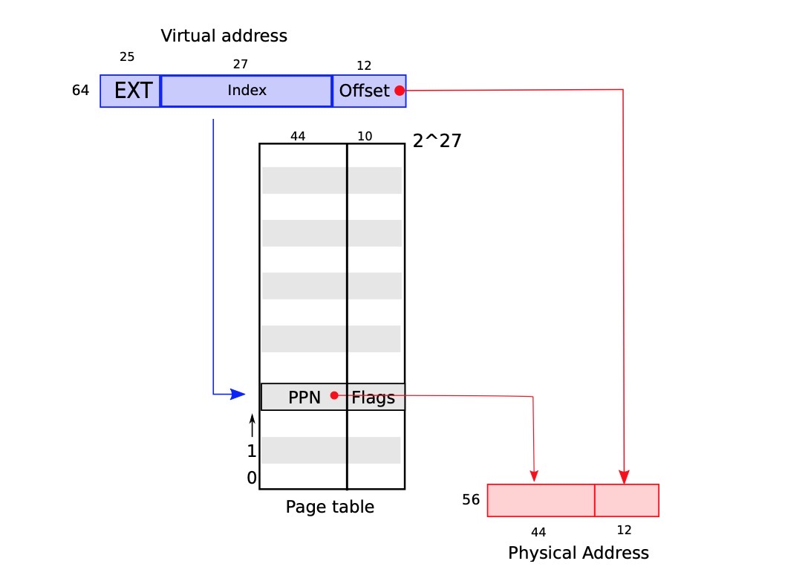

PageTable是操作系统提供一个最好的机制了,它让每个程序都有自己独立的地址空间和内存既视感.PageTable可以决定一个内存地址代表啥含义,并且它可以决定哪部分的物理内存可以被访问.PageTable允许XV6来隔离进程地址空间,并且在同一个物理内存上复用他们.Pagetable变得如此流行,因为它提供了一种间接的方式可以允许操作系统系统执行很多trick的操作.XV6可以执行如下的一些trick:可以将同一块内存(trampoline page)映射到不同的地址空间里面(其实每个process都有一个自己独立的地址空间,pagetable存在的意义为每个process都提供一个独立的地址空间,以达到process内存隔离的效果,但是这里也可以trick),并且使用一段未映射的页面包保护kernel和用户栈的界限.这章节我们将会RISC-V硬件提供的pagetable,并且我们将会展示xv6如何使用他们. 

## Paging Hardware
&emsp;我们需要注意的是,RISC-V指令(用户态和内核态都有)来操作虚拟内存地址.主存或者物理内存是通过物理地址来索引的.RISC-V page table硬件通过每个虚拟内存地址映射到一个物理内存上面的方式来连接这两种内存的.

&emsp;xv6运行在Sv39 RISC-V上面,这意味着64位虚拟地址只有低39位被使用了,顶部的25位没有被使用.在这个Sv39配置里面,一个RISC-V pagetable在逻辑上是一个`2^27  134217728`的`page table entries(PTEs)`数组.每个PTE包含一个44位的物理页编号(Physical Page Number : PPN)和一些其他的标识符.Paging hardware翻译虚拟地址的方式如下:首先通过虚拟机地址的39位的头部27位在page table里面索引找到一个PTE(一个PTE里面包含一个44位的PPN和一些标识符),然后用PTE里面的44位PPN和原始虚拟地址的最后12位组成了一个56位的虚拟地址.(图3.1显示这个逻辑处理过程,我们将会在3.2显示整个过程).一个Page Table以4KB的粒度一个Chunk来控制虚拟地址和物理地址之间的映射.这样的一个Chunk被称为一个Page.
Figure2.1



&emsp;在Sv39的RISC-V里面,虚拟地址开始25位并不会被用来做地址转换.(这个25位是为了方便以后扩展).在物理地址里面同样有这样一个预留空间用来方便以后扩展,这个区域在物理内存里面表示就是PTE格式里面的PPN可以通过占用另外10个bit来扩展.RISC-V这样设计是基于如下考虑: 2^39是512GB内存,这个足够任何程序运行在RISC-V上面了. 而2^56的物理内存完全足够容纳任何可能的IO设备或者DRAM芯片.如果需要更多的内存,RISC-V可以定义Sv48使用48位来表示虚拟内存.

&emsp;正如Figure3.2所展示的,RISC-V将一个虚拟地址转换成物理地址需要经过三个步骤.page table是存储在物理内存上面的一个三级树形结构.Root是一个4096字节的page-table页面,里面包含了512个PTEs,每个PTE里面包含了下一层级树所在的物理地址(PTE里面的地址是物理地址,这个物理地址对应的物理内存里面存放的是下一级tree).在二级树里面也包含了512个PTEs,同理每个PTE里面都存放了最后一级树的物理地址.PagingHardware会使用虚拟地址27位的前9位来从root pTEs树里面挑选一个PTE,中间的9位从第二级树里面定位出一个PTE,后面9位是从最后一级树里面赛选出一个PTE,(在Sv48的RISC-V里面使用4级树形结构,在这个结构里面是使用地39-47位来索引root tree).


&emsp;如果一个由三个PTE转换后的物理地址不存在,那么PagingHardware将会抛出一个`page-falt`的错误,然后把它传递给kernel让kernel去处理(详细看第四章).
&emsp;相比较这种单级结构,三级树形结构是以一种更为高效的方式来记录PTE.正常情况下,如果一个大的范围的虚拟地址映射是无效的,那么三级结构下就可以省去不需要的目录了(例如root里面就没有映射,那么二级三级的tree就可以省去不用占内存).例如一个应用只使用了很少以0开头的页面的话,那么root tree里面的1-511的条目都是非法的,那么kernel就不需要为这511个条目分配内存.kernel也不需要为这511个条目分配内存去容纳它的下一级目录.

&emsp;尽管CPU遍历这样一个三级层次结构在硬件层面执行的作为它的加载或者存储指令(读取也表是硬件执行执行的),这样潜在的问题就是CPU继续加载三个PTE来执行将虚拟地址转换成一个物理地址.为了避免从物理内存里面加载PTE的性能消耗,RISC-V CPU将整个page table 条目都缓存到TLB里面(Translation Look-aside Buffer)

&emsp;每个PTE都有一个flag位来告诉Pageing hardware 相关联的虚拟地址应该如何被使用.`PTE_V`来表示PTE是否存在,如果它没有设置,那么对该页面的引用将会导致一个异常(不允许引用).`PTE_R`来控制指令是否允许读取这个page.`PTE_W`来控制指令是否允许往这个页面里面写数据.`pTE_X`来控制是否允许CPU把这个页面里面的内容当作指令并且来执行.`PTE_U`控制是否允许用户态的程序来访问这个页面,如果`PTE_U`没有被设置,那么这个页面只允许在supervisor模式下被访问.下面图展示他们是如何工作的.Flags和其他一些page相关的数据结构被定义在`kernel/riscv.h`里面


&emsp;为了告诉硬件到哪儿去使用一个page table,kernel必须把root page table的物理地址写入到`stap`寄存器里面.每个CPU都有自己的`stap`寄存器.CPU 将会使用它自己`stap `寄存器里面的root page table及其后续追踪出来的二级三级page table的数据来转换所有的虚拟地址.

&emsp;特别内核将所有的物理地址映射到它自己的虚拟地址(内核的映射是一一映射),这样内核就可以通过加载/存储直接直接操作物理内存的任何一个区域了.由于pagetable directories是放在物理内存里面的,这样内核就可以通过一个标准的存储指令向一个PTE的虚拟地址写入内容从而达到最PTE编程的效果(因为对内核而言虚拟地址就是物理地址,这两者是完全等价的).

&emsp;有一些术语是我们需要关注的,Physical memory指代的是DDRAM.物理内存里面任何一个byte都有一个地址,这个地址被称为物理地址. Intruction操作的都是虚拟地址,然后虚拟地址由paging hardware来转换成物理地址(这个是由paging hardware硬件完成),然后对DDRAM写入或者读取数据.和物理地址和虚拟地址不同,虚拟内存并不是一个物理对象,它指代的时候kernel用来管理物理内存和虚拟地址一些列机制的集合.(虚拟内存是一个机制,它管理物理内存和虚拟地址.通过将虚拟地址翻译成物理地址,从而来操作物理内存).


## Kernel Address Space
&emsp;Xv6为每个process都维护了一个pagetable,用来描述每一个程序的用户地址空间+ 一个用来描述kernel地址空间的页面.kernel通过配置它自己的地址空间布局,以方便它可以访问任何物理内存和一些提前预定义好的硬件地址的虚拟地址(这些地址是由厂商提前定义好).下面的图片展示了内核地址空间和物理地址空间的映射关系.文件`kernel/memorylayout.h`描述了xv6内核的内存布局.
```c
// Physical memory layout

// qemu -machine virt is set up like this,
// based on qemu's hw/riscv/virt.c:
//
// 00001000 -- boot ROM, provided by qemu
// 02000000 -- CLINT
// 0C000000 -- PLIC
// 10000000 -- uart0 
// 10001000 -- virtio disk 
// 80000000 -- boot ROM jumps here in machine mode
//             -kernel loads the kernel here
// unused RAM after 80000000.

// the kernel uses physical memory thus:
// 80000000 -- entry.S, then kernel text and data
// end -- start of kernel page allocation area
// PHYSTOP -- end RAM used by the kernel
```
&emsp;Qemu既然模拟了计算机,那它当然也包括内存(物理内存),并且它在物理内存`0x8000000`的地方开始,然后继续到`0x86400000`地方结束.Qemu同样还模拟了IO设备,例如磁盘接口.Qemu通过内存映射到控制器寄存器的方式来保留这些设备的接口,这些设备的内存地址位于`0x80000000`下面.当然内核可以直接通过他们的特殊的内存地址读写数据来控制这些设备,而不是和内存通信;第四章我们将会解释XV6如何和设备通信.


&emsp;kernel通过直接映射的方式来获取RAM以及内存映射的控制寄存器:直接映射意味着虚拟地址等价于物理地址;例如kernel将它自己开始的地方定位在`0x8000000`,这个地址即是虚拟地址,同时也是物理地址.直接映射简化了内核代码读写物理内存的方式(不需要做地址转换了).例如当调用`fork`来创建一个子进程的时候,内存分配器会直接返回 那段内存的物理地址,kernel就可以使用这个地址来直接将parent进程的数据copy给子进程.

&emsp;当然内核地址空间并不是完全一一映射的,有几个例外:
- trampoline Pgae.它被映射到虚拟地址的最顶部. 用户态pagetable也有同样的一个映射.第四章我们将会讨论trampoline的作用,但是在这里我们看到一个有趣的现象:物理页面被映射了两次(kernel的虚拟地址空间里面),一次在虚拟地址空间的顶层,一次是直接映射.
- kernel stack page: 每个进程都有一个自己的kernel stack,它被映射到高位,这样在这个kernel stack page和用户态的内存地址之间留有一个未被映射的内存地址用来保护kernel stack page和用户虚拟地址不会越界.保护页面的PTE是非法的(PET_V位没有被设置),这样kernel stack越界了,那么就会抛出异常. 如果没有这个保护页面那么kernel的内存数据就会被覆盖掉.从而造成很严重的问题.

&emsp;kernel使用自己的stack通过一个高位的内存映射,当然内核也可以通过直接映射来访问stack(因为内核映射是一一映射).因此也有另外一种设计,就单纯的使用直接映射,通过直接映射地址来使用这些栈地址. 在这种架构下,提供未映射的虚拟地址可能会指向一个实际的物理内存,这个会导致系统很难处理.

&emsp;kernel用来给trampoline 和 kernel text的页面设置了`PET_R`和`PET_X`的权限.kernel从这个里面读取并执行指令.kernel映射其他页面设置的权限是`PTE_R`和`PTE_W`,因此kernel可以对这些内存进行读写操作.保护页面的映射是无效的(也许是设置了`PTE_V`)

## Code: Create an address space
&emsp;大部分xv6操作内存和页表的代码位于`vm.c`里面,(kernel/vm.c:1).核心的数据结构是`pagetable_t`,这是一个指向RISC-V root page table的指针.一个page table它有可能是内核的page table,也有可能是一个用户态进程的pagetable.核心函数`walk`这个函数功能是为一个虚拟地址找到对应的PTE,`mappages`函数是为一个新的映射安装PTEs.以`kvm`开头的函数操作的对象都是内核页表,以`uvm`开头的函数操作的都是用户态的页表,其他的函数通用.`copyin`和`copyout`函数用于可以根据syscall 参数提供的虚拟地址将数据copy到用户态或者将数据从用户态copy出来,这两个函数位于`vm.c`,因为他们需要将虚拟地址转换成对应的物理地址.

&emsp;在早起的启动顺序里面,`main`函数调用`kvminit(kernel/vm.c)`,`kvminit`函数通过调用`kvmmake`来创建kernel的页表.这几个操作在XV6启动页表功能之前就被调用了,因此可以将虚拟地址直接当作物理地址.`Kvmmake`首先会为一个page分配一个物理内存空间,用来存放root page-table的page.然后它调用`kvmmap`来根据内核的需要设置所有地址映射.这些映射包含了kernel的指令和数据,物理地址截止到`PHYSTOP`,以及设置一些设备的内存范围. `proc_mapstack`(kernel/proc:33)为每个process分配一段kernel stack.它主要通过调用`kvmmap`来将每个stack映射到一个受`KSTACK`保护的虚拟地址上,它留下了一点空间给栈保护页面.
```c
void main() {
    kvminit();       // create kernel page table
}

void kvminit(void) {
  kernel_pagetable = kvmmake(); // kvminit调用kvmmake来创建pagetable
}

void main() {
pagetable_t kvmmake(void)
{
// 调用 kalloc 申请一块一个page大小的内存给kpgtbl
  pagetable_t kpgtbl;
  kpgtbl = (pagetable_t) kalloc();
  memset(kpgtbl, 0, PGSIZE);
  kvmmap(kpgtbl, UART0, UART0, PGSIZE, PTE_R | PTE_W); // uart registers
  ...
  kvmmap(kpgtbl, TRAMPOLINE, (uint64)trampoline, PGSIZE, PTE_R | PTE_X);
  // map kernel stacks 为每一个进程都分配一个kernel栈
  proc_mapstacks(kpgtbl);
  return kpgtbl;
}
  
#define KSTACK(p) (TRAMPOLINE - (p)*2*PGSIZE - 3*PGSIZE)
void proc_mapstacks(pagetable_t kpgtbl) {
  struct proc *p;
  for(p = proc; p < &proc[NPROC]; p++) {
    char *pa = kalloc();
    uint64 va = KSTACK((int) (p - proc));
    kvmmap(kpgtbl, va, (uint64)pa, PGSIZE, PTE_R | PTE_W);
  }
}
// 这个kernel栈地址位于TRAMPOLINE地址下面(由于栈是向上增加)
```
&emsp;`kvmmap`(kernel/vm.c:127)调用`mappages`(kernel/vm.c:138)来将一段范围内的虚拟地址映射到对应的物理地址上.它对这个范围内的每一个虚拟地址都执行这样的操作,以页面为单位.针对每一个被映射的虚拟地址,`mappages`会调用`walk`函数来找到对应的PTE,它然后初始化这个PTE用来存放相关的physical page number,以及一些应该设备的权限(权限可以参考上面);

```c
// add a mapping to the kernel page table. // only used when booting. // does not flush TLB or enable paging.
void kvmmap(pagetable_t kpgtbl, uint64 va, uint64 pa, uint64 sz, int perm)
{
  if(mappages(kpgtbl, va, sz, pa, perm) != 0)  // 本质上还是调用mappages 函数来创建pagetable映射
    panic("kvmmap");
}
#define PGROUNDUP(sz)  (((sz)+PGSIZE-1) & ~(PGSIZE-1))
#define PGROUNDDOWN(a) (((a)) & ~(PGSIZE-1))
// 针对给定的虚拟地址创建一个PTE,这个虚拟地址是从va开始的,指向的物理地址是从pa开始的 ,成功返回0，失败返回-1
int mappages(pagetable_t pagetable, uint64 va, uint64 size, uint64 pa, int perm)
{
  uint64 a, last;
  pte_t *pte;
  a = PGROUNDDOWN(va);
  last = PGROUNDDOWN(va + size - 1);
  for(;;){
    if((pte = walk(pagetable, a, 1)) == 0) //通过walk函数根据va的地址来返回一个对应PTE的地址,如果alloc!=0,那么它会创建一个
      return -1;
    if(*pte & PTE_V)
      panic("mappages: remap");
    *pte = PA2PTE(pa) | perm | PTE_V;
    if(a == last)
      break;
    a += PGSIZE;
    pa += PGSIZE;
  }
  return 0;
}
```

&emsp;`walk`函数是XV6用来模仿硬件针对给定一个虚拟地址来查找对应的PTE(但是这个实际计算机里面是由硬件来完成的).walk函数通过9个bit一次下降一级tree.它使用虚拟地址的每个层级的9位来找到对应的PTE,针对这个PTE来找到下一级的树里面的PTE.如果PTE是非法的,那么申请的页面将不会被分配.如果`alloc`参数被设置了,那么`walk`函数会重新分配一段内存空间,然后把它的内存地址放到PTE里面.walk 返回最后一级PTE里面的物理地址.
```c
#define PXMASK          0x1FF // 9 bits
#define PXSHIFT(level)  (PGSHIFT+(9*(level)))
#define PX(level, va) ((((uint64) (va)) >> PXSHIFT(level)) & PXMASK)
#define PA2PTE(pa) ((((uint64)pa) >> 12) << 10)
// The risc-v Sv39 scheme has three levels of page-table
// pages. A page-table page contains 512 64-bit PTEs.
// A 64-bit virtual address is split into five fields:
//   39..63 -- must be zero.
//   30..38 -- 9 bits of level-2 index.
//   21..29 -- 9 bits of level-1 index.
//   12..20 -- 9 bits of level-0 index.
//    0..11 -- 12 bits of byte offset within the page.
pte_t * walk(pagetable_t pagetable, uint64 va, int alloc) {
  if(va >= MAXVA) panic("walk");

  for(int level = 2; level > 0; level--) {
    pte_t *pte = &pagetable[PX(level, va)]; // 从pagetable里面找到PTE的地址
    if(*pte & PTE_V) {
      pagetable = (pagetable_t)PTE2PA(*pte); // 如果root(上一level),则将pagetable下沉一级
    } else { // 查找失败,如果alloc!=0,则分配一个,否则返回-1
      if(!alloc || (pagetable = (pde_t*)kalloc()) == 0)
        return 0;
      memset(pagetable, 0, PGSIZE); // 清理pagetable
      *pte = PA2PTE(pagetable) | PTE_V; // 将pagetable flag设置为PTE_V
    }
  }
  return &pagetable[PX(0, va)];
}
```
&emsp;上面的代码依赖内核提前将物理地址直接映射到虚拟内存地址.例如正如`walk`降级它的pagetable,它从一个PTE里面提取下一层级page-table page的物理内存地址,然后直接用这个地址当作虚拟地址来获取下一级的page-table page.

&emsp;`main`调用`kvminithart`(kernel/vm.c:62)来设置kernel的page table.它把root page-tale page的物理地址写入到`stap`寄存器里面.在这之后CPU就会使用kernel的页表来做地址转换,由于kernel的映射是一种直接映射, 现在虚拟地址就是真正的物理地址.

```c
#define MAKE_SATP(pagetable) (SATP_SV39 | (((uint64)pagetable) >> 12))
void kvminithart() {
  w_satp(MAKE_SATP(kernel_pagetable));
  sfence_vma();
}
static inline void w_satp(uint64 x) {
  asm volatile("csrw satp, %0" : : "r" (x)); // 将x写入到satp寄存器里面
}
static inline void sfence_vma() {
  // the zero, zero means flush all TLB entries.
  asm volatile("sfence.vma zero, zero");  // 通过sfence.vma 指令清除所有的TLB缓存
}
// 通过写satp寄存器来更新 pagetable为kernel的pagetable,然后清理所有的TLB缓存,这个时候kernel就开始在自己的pagetable上进行工作了
```

&emsp;每个RISC-V CPU都会将page table条目缓存到TLB里面,当xv6 改变一个page table,它必须告诉CPU要将TLB里面对应的page table条目设置为非法.如果没有这么做的话,在某种情况下TLB 也会还会用到这个过时的缓存,这个过时的缓存里面也许是存放的时候另外一个物理地址(这个物理地址已经被分配给其他的进程)这个就破坏了隔离性..RISC-V提供了`sfence.vma`指令用来刷新当前CPU的TLB. xv6在`kvminithart`函数里面执行`sfence.vma`,然后重新reload `satp`寄存器,然后在trampoline代码里面切换到一个用户的页表,在切换到用户态之前.(页表的转换,即内核态进入用户态之前,kernel会先刷新TLB,然后在trampoline将用户态的页表加载到 stap寄存器里面,然后在切换到用户态)

&emsp;为了避免整个TLB被刷新,RISC-V CPu提供了地址空间识别功能(ASIDs),这样kernel 就可以针对某个地址空间来刷新TLB了(而不需要把整个cache都清空掉重新加载)


## Physical memory allocation
&emsp;kernel必须在运行时能够为一个页表或者用户内存或者kernelstack或者pipe buffers来分配或者释放内存.
&emsp;xv6使用位于kernel结束的内存位置一直到`PHYSTOP`这中间的一段内存空间用来分配.它一次可以分配或者释放一个4096kb的页面.它通过在页表里面增加一个连表来追踪哪些页面是free的.分配包括从连表里面删除一个页面,释放是将页面添加到连表里面.


## Code: Physical memory allocator
&emsp;内存分配的代码位于`kalloc.c`(kernel/kalloc:1)里面.Allocator的数据结构是一个物理内存页面的freelist,这个里面包含了可以用于分配的内存.这个freelist连表里面每一个元素都是一个`struct run`的结构体(kernel/kalloc.c:7).那么allocator又是从哪里获得内存用来存放这些数据结构的呢?它将每个free page的run结构体存放在free page本身里面,因为还没有任何东西存储在哪里. free-list是被spin lock给保护的.(kernel/kalloc.c:21).这个表链和锁被一起封装在一个结构体里面,用来表明这个结构体里面的字段都是受这个锁保护的(这样看起来更清晰点).目前我们先不用管锁的释放和保护(第六章会讨论到)

```c
struct run {
  struct run *next;
};
struct {
  struct spinlock lock;
  struct run *freelist;
} kmem;
```

&emsp;main函数会调用`kinit`来初始化内存分配器.`kvminit`调用`freerange`来将kernel结束后的第一个地址到PHYSTOP之间的内存都添加到freelist里面.xv6理论上应该是通过解析硬件提供的配置文件来决定有多少物理内存来使用.但是在这里我们假设物理内存总共有128G.`kinit`最终调用`freerange`函数,`freerange`是通过调用kfree将每个page都添加到freelist里面的(i详细过程看下面的代码).由于一个PTE应该指向一个4kb对其的物理地址,因此在`freerange`函数里面调用`PGROUNDUP`宏来保证freelist里面每个page都是4kb对其的. 由于这个`allocator`一开始没有内存,因此会调用`kfree`会给他一些来管理

```c
void main() {
  ....
  kinit();         // physical page allocator 初始化物理内存分配器
  kvminit();       // create kernel page table 创建一个kernel pagetable
  kvminithart();   // turn on paging  开始启用kernelpagetable
  ...
}
void kinit() { // 初始化内存分配器
  initlock(&kmem.lock, "kmem"); // 初始化锁
  freerange(end, (void*)PHYSTOP);
}
extern char end[]; // first address after kernel. kernel之后的第一个地址，定义在kernel.ld， 下面注释引用了kernel.ld里面内容
/*
OUTPUT_ARCH( "riscv" )
ENTRY( _entry )
SECTIONS
{
  . = 0x80000000;
  .text : {
  }
  .rodata : {
  }
  .data : {
  }
  .bss : {
  }
  PROVIDE(end = .);  // kernel结束的位置
}
*/
#define PGROUNDUP(sz)  (((sz)+PGSIZE-1) & ~(PGSIZE-1))
#define PHYSTOP (KERNBASE + 128*1024*1024)
void freerange(void *pa_start, void *pa_end) // pa_start就是kernel结束后的第一个地址, pageend就是 就是kernel结束后+ 128G
{
  char *p;
  p = (char*)PGROUNDUP((uint64)pa_start);
  for(; p + PGSIZE <= (char*)pa_end; p += PGSIZE)
    kfree(p); // 对每个page页面都执行kfree 函数
}
```
&emsp;allocator有时候为了方便计算会把地址当作一个整数来对待,有时候为了读写内存会把地址当作指针来看待,地址的双重使用是分配器充满了一股C语言的味道.
&emsp;`kfree`函数会通过将内存里面每个bit位都设置为1来初始化他们,这个会导致当代码尝试读取被释放后的内存会读取到的是一个垃圾数据,而不是老数据,充满希望的时候这个会导致代码更快的出问题(这个出问题是好的,读取意想不到的数据会使得程序更难debug).然后kfree函数准备将page添加到freelist里面:它将pa强制转换成`struct run`结构的指针,然后将`kmem.freelist`赋值给`r->next`,最终`kmem.freelist = r`方式来讲page添加到freelist里面. `kalloc`函数会返回并且删除kfreelist里面第一个元素.

```c
void kfree(void *pa)
{
  struct run *r;

  if(((uint64)pa % PGSIZE) != 0 || (char*)pa < end || (uint64)pa >= PHYSTOP)
    panic("kfree");

  // Fill with junk to catch dangling refs.
  memset(pa, 1, PGSIZE);

  r = (struct run*)pa;

  acquire(&kmem.lock);
  r->next = kmem.freelist;
  kmem.freelist = r;
  release(&kmem.lock);
}

// kalloc申请内存逻辑
void * kalloc(void)
{
  struct run *r;
  r = kmem.freelist; // 从freelist里面提取一个元素(freelist里面是可分配的)
  kmem.freelist = r->next;  // 将分配出来的内存从freelist里面移除掉
  memset((char*)r, 5, PGSIZE); // fill with junk // 初始化内存
  return (void*)r;
}
```

## Process address space
&emsp; 每个进程都有一个自己独立的page table,如果xv6在进程之间做切换的时候,它同样也会切换对应进程的pagetable.正如之前我们了解到的,一个进程的虚拟地址从0开始,最大地址为`MAXV`(这个值定义在`kernel/riscv.h:6`)里面,它允许一个进程最大能够使用256GB的内存.
&emsp;让一个进程向xv6申请更多内存的时候,xv6首先会调用`kalloc`来申请一块新的内存.xv6然后会将一个指向刚刚申请到物理内存的PTE加入到进程的pagetable里面. xv6会将这些PTE的权限设置为`PTE_W`,`PTE_X`,`PTE_R`,`PTE_U`,和`PTE_V`.大部分时候用户程序基本上是不会用到整个虚拟地址空间的.xv6会在没有使用到的PTE里面清除`PTE_V`这个标识.(没有设置PTE_V意味着这个PTE是非法的,不可访问的).

&emsp;我们在这里会看到一些很有意思的pagetable使用方式.首先不同进程的pagetable将用户的虚拟地址转换成对应的物理地址,因为每个进程都有各自私有的地址空间.另外每个进程看到的自己的虚拟内存地址都是连续的,并且都是从0开始的,尽管他们的物理地址是不连续的.最后kernel会将一个里面带有trampoline代码的页面映射到用户虚拟地址空间的最顶部,因此在所有的地址空间里面都会看到这样一个物理页面.


figure3_4

&emsp;上面图片展示了详细的展示了一个xv6上可执行的进程的内存布局图.stack是一个单独的页面, 这个图里面展示的内容和我们执行一个exec命令是差不多的.在栈的顶部是一个指针数组,里面指向的是命令行参数的字符串.在哪些值下面的值是可以让程序在main函数启动.

&emsp;为了检测用户栈是不是存在溢出问题,xv6在这个栈下面防止了一个不可访问的用来保护栈的页面(这个页面的权限被清除了`PTE_U`标志:这个意味着用户空间不可访问).如果用户程序试图溢出栈,硬件会生成一个page falt的异常,因为溢出的页面在用户态空间是不可访问的.

## Code: sbrk
&emsp;`Sbrk`是一个系统调用,用来增加或者减少一个程序的内存.这个syscall是通过函数`growproc`来实现的.`growproc`函数调用`uvmalloc`或者`uvmdealloc`函数,这两个函数具体调用哪个取决于参数`n`是正数还是负数.`uvmalloc`通过`kalloc`来分配内存,并且通过`mapppages`来将PTE添加到用户页表里面.

```c
uint64 sys_sbrk(void) { // sys_sbrk 本质是调用了growproc函数k
  ...
  if(growproc(n) < 0)
    return -1;
  return addr;
}
// Grow or shrink user memory by n bytes.
// Return 0 on success, -1 on failure.
int
growproc(int n)
{
  uint sz;
  struct proc *p = myproc();

  sz = p->sz;
  if(n > 0){
    if((sz = uvmalloc(p->pagetable, sz, sz + n)) == 0) {
      return -1;
    }
  } else if(n < 0){
    sz = uvmdealloc(p->pagetable, sz, sz + n);
  }
  p->sz = sz;
  return 0;
}
```
&emsp;xv6使用process的页表不仅仅是告诉硬件如何翻译用户的虚拟地址,还记录了哪一块的物理内存已经分配那个进程了.这就是为什么释放用户内存同样需要检查页表的缘故;

```c
void uvmunmap(pagetable_t pagetable, uint64 va, uint64 npages, int do_free) {
  uint64 a;
  pte_t *pte;

  if((va % PGSIZE) != 0)
    panic("uvmunmap: not aligned");

  for(a = va; a < va + npages*PGSIZE; a += PGSIZE){
    if((pte = walk(pagetable, a, 0)) == 0)
      panic("uvmunmap: walk");
    if((*pte & PTE_V) == 0)
      panic("uvmunmap: not mapped");
    if(PTE_FLAGS(*pte) == PTE_V)
      panic("uvmunmap: not a leaf");
    if(do_free){
      uint64 pa = PTE2PA(*pte);
      kfree((void*)pa);
    }
    *pte = 0;
  }
}
```

## Code: exec
&emsp;`Exec`是一个系统调用,用来创建一部分用户地址空间.它使用文件系统上一个镜像文件来初始化这部分用户地址空间.`exec`使用`namei`来打开二进制文件路径,这个我们会在第八章详细解释.然后它会读取这个ELF格式二进制文件头部.xv6二进制文件头部描述在`kernel/elf.h`文件里面.一个ELF二进制文件包含了ELF头部信息,`struct elfhdr`(kernel/elf.h:6),接下来就是程序的各个部分了,`struct proghdr`(kernel/elf.h:25).每个`proghdr`都描述了这个应用程序里面具体每个段应该被加载到哪个地方.xv6里面只有一个program section header,但是在系统系统里面也许还会分指令段和数据段.

```c
int exec(char *path, char **argv) {
  char *s, *last;
  int i, off;
  uint64 argc, sz = 0, sp, ustack[MAXARG], stackbase;
  struct elfhdr elf;
  struct inode *ip;
  struct proghdr ph;
  pagetable_t pagetable = 0, oldpagetable;
  struct proc *p = myproc();

// 打开elf文件
  if((ip = namei(path)) == 0){ end_op(); return -1; }
  // Check ELF header 检查是不是合法的ELF文件
  if(readi(ip, 0, (uint64)&elf, 0, sizeof(elf)) != sizeof(elf)) goto bad;
  if(elf.magic != ELF_MAGIC) goto bad;

  // 通过proc_pagetable创建一个没有映射页面
  if((pagetable = proc_pagetable(p)) == 0) goto bad;

  // Load program into memory.
  for(i=0, off=elf.phoff; i<elf.phnum; i++, off+=sizeof(ph)){
    if(readi(ip, 0, (uint64)&ph, off, sizeof(ph)) != sizeof(ph))
      goto bad;
    if(ph.type != ELF_PROG_LOAD)
      continue;
    if(ph.memsz < ph.filesz)
      goto bad;
    if(ph.vaddr + ph.memsz < ph.vaddr)
      goto bad;
    uint64 sz1;
    if((sz1 = uvmalloc(pagetable, sz, ph.vaddr + ph.memsz)) == 0)
      goto bad;
    sz = sz1;
    if((ph.vaddr % PGSIZE) != 0)
      goto bad;
    if(loadseg(pagetable, ph.vaddr, ip, ph.off, ph.filesz) < 0)
      goto bad;
  }
  iunlockput(ip);
  end_op();
  ip = 0;

  p = myproc();
  uint64 oldsz = p->sz;

  // Allocate two pages at the next page boundary.
  // Use the second as the user stack.
  sz = PGROUNDUP(sz);
  uint64 sz1;
  if((sz1 = uvmalloc(pagetable, sz, sz + 2*PGSIZE)) == 0)
    goto bad;
  sz = sz1;
  uvmclear(pagetable, sz-2*PGSIZE);
  sp = sz;
  stackbase = sp - PGSIZE;

  // Push argument strings, prepare rest of stack in ustack.
  for(argc = 0; argv[argc]; argc++) {
    if(argc >= MAXARG)
      goto bad;
    sp -= strlen(argv[argc]) + 1;
    sp -= sp % 16; // riscv sp must be 16-byte aligned
    if(sp < stackbase)
      goto bad;
    if(copyout(pagetable, sp, argv[argc], strlen(argv[argc]) + 1) < 0)
      goto bad;
    ustack[argc] = sp;
  }
  ustack[argc] = 0;

  // push the array of argv[] pointers.
  sp -= (argc+1) * sizeof(uint64);
  sp -= sp % 16;
  if(sp < stackbase)
    goto bad;
  if(copyout(pagetable, sp, (char *)ustack, (argc+1)*sizeof(uint64)) < 0)
    goto bad;

  // arguments to user main(argc, argv)
  // argc is returned via the system call return
  // value, which goes in a0.
  p->trapframe->a1 = sp;

  // Save program name for debugging.
  for(last=s=path; *s; s++)
    if(*s == '/')
      last = s+1;
  safestrcpy(p->name, last, sizeof(p->name));
    
  // Commit to the user image.
  oldpagetable = p->pagetable;
  p->pagetable = pagetable;
  p->sz = sz;
  p->trapframe->epc = elf.entry;  // initial program counter = main
  p->trapframe->sp = sp; // initial stack pointer
  proc_freepagetable(oldpagetable, oldsz);

  if (p->pid > 1)
    vmprint(p->pagetable);

  return argc; // this ends up in a0, the first argument to main(argc, argv)

 bad:
  if(pagetable)
    proc_freepagetable(pagetable, sz);
  if(ip){
    iunlockput(ip);
    end_op();
  }
  return -1;
}

```

&emsp;首先它会快速的检查一个程序是不是一个合法的ELF格式文件.一个合法的ELF格式文件前面四个字节是固定的,分别是`0x7F`,'E','L','F'或者是定义好的MAGIC`ELF_MAGIC 0x464C457FU  // "\x7FELF" in little endian`,如果这个检验正确,那么exec就会认为它是一个合法的ELF文件

&emsp;exec会创建一个新的页面,这个页面没有任何用户虚拟地址映射,通过`proc_pagetable`函数(kernel/exec.c:38). 这个函数通过调用`uvmcreate`函数为elf里每个段都分配一段内存空间.然后通过`loadseg`函数将elf的段加载到对应的内存里面.`loadseg`函数会通过`walkaddr`函数来找到刚刚分配的物理内存,这个内存就是刚刚用来写elf进去,也可以通过readi来读取文件.

```c
// Create a user page table for a given process,
// with no user memory, but with trampoline pages.
pagetable_t
proc_pagetable(struct proc *p)
{
  pagetable_t pagetable;

  // An empty page table.
  pagetable = uvmcreate();
  if(pagetable == 0)
    return 0;

  // map the trampoline code (for system call return)
  // at the highest user virtual address.
  // only the supervisor uses it, on the way
  // to/from user space, so not PTE_U.
  if(mappages(pagetable, TRAMPOLINE, PGSIZE,
              (uint64)trampoline, PTE_R | PTE_X) < 0){
    uvmfree(pagetable, 0);
    return 0;
  }

  // map the trapframe just below TRAMPOLINE, for trampoline.S.
  if(mappages(pagetable, TRAPFRAME, PGSIZE,
              (uint64)(p->trapframe), PTE_R | PTE_W) < 0){
    uvmunmap(pagetable, TRAMPOLINE, 1, 0);
    uvmfree(pagetable, 0);
    return 0;
  }

  // add mapping for usyscall
  if (mappages(pagetable, USYSCALL, PGSIZE, (uint64)(p->usyscall), PTE_U | PTE_R) < 0){
      uvmunmap(pagetable, TRAMPOLINE, 1, 0);
      uvmunmap(pagetable, TRAPFRAME, 1, 0);
      uvmfree(pagetable, 0);
      return  0;
  }

  return pagetable;
}
```

&emsp; 程序头部段里面的`filez`字段也许会比`memsz`的值小,这意味着他们之间应该应该用0填充,而不是继续从文件里面都内容填充到这个里面.对于`/init`这个参数,filez的大小是2112,memsz的大小是2136,因此`uvmalloc`会仍然分配2136字节大小内存来存放数据,但是只从`/init`这个文件里面读取2112个字节.

&emsp;现在`exec`开始分配和初始化用户栈.它只会分配一个页面的栈.exec会将参数字符串一次性全部拷贝到栈顶,然后把指向他们内存的指针记录到`ustack`里面.并且他会在尾部防止一个空指针来传递给main函数.`ustack`里面前面三个元素是`返回函数的程序计数器`,`argc`,`argv`指针.

&emsp;然后Exec会在这个栈的下面防止一个不可访问的页面.因此程序试图访问超过1个页面的栈空间会报错.但是这个不可访问的页边可以让exec来处理参数过大的问题.在这种情况下,exec将会使用`copyout`函数将参数copy到栈上,一旦它注意到目的page是不可访问的,它会返回一个`-1`.

&emsp;在准备新的内存镜像的时候,如果exec检测到一个类似非法的程序段的时候,它将会跳转到`bad lebal` 地方执行,然后释放镜像内存,然后返回-1.exec会等待到旧的镜像内存完全被释放掉,然后这个系统调用才会完全执行成功.如果旧的镜像已经被清理了,那么exec 不会返回-1.exec执行唯一错误的例子可能就是在加载的镜像的时候失败.一旦镜像完成了,那么exec就可以把它提交到新的page里面,然后释放老的page.


&emsp;exec把elf文件里面的的内容加载到elf指定的地方.用户和程序其实可以将任意的他们想要的内存地址写入到elf文件里面. 因此exec是有风险的,因为用户写入的内存地址可能指向kernel,用于一些不好的目的或者用于破坏.如果内核处理不当导致很严重的后果,可导致内核crash或则使得内核的隔离机制失效.xv6会执行一些列的检查来避免这个问题.


